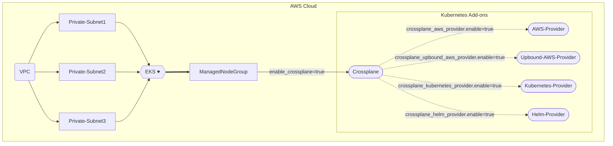
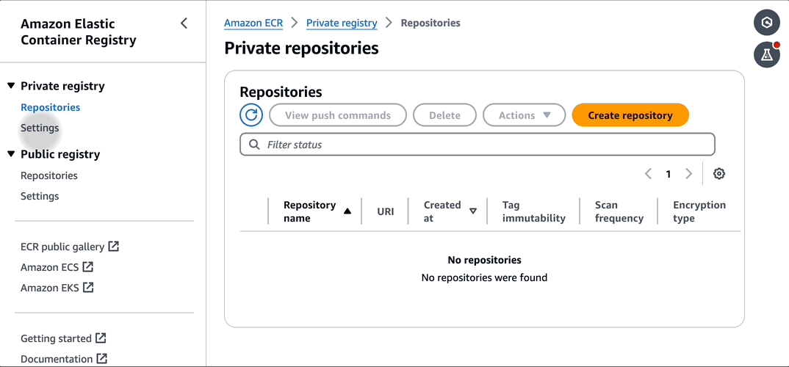

# EKS Cluster bootstrap with Terraform for Crossplane

This example deploys the following components
- Creates a new sample VPC with Two Private Subnets and the required VPC Endpoints
- Creates EKS Cluster Control plane with one managed node group
- Crossplane Add-on to EKS Cluster
- Upbound AWS Provider for Crossplane
- AWS Provider for Crossplane
- Kubernetes Provider for Crossplane
- Helm Provider for Crossplane

## Crossplane Deployment Design



## How to Deploy

### Prerequisites:
Ensure that you have installed the following tools on your laptop before starting to work with this module and run Terraform Plan and Apply:

1. [AWS CLI](https://docs.aws.amazon.com/cli/latest/userguide/install-cliv2.html)
2. [Kubectl](https://kubernetes.io/docs/tasks/tools/)
3. [Terraform >= v1.0.0](https://learn.hashicorp.com/tutorials/terraform/install-cli)
4. [jq](https://stedolan.github.io/jq/download/) - Command-line JSON processor
5. [crane](https://github.com/google/go-containerregistry/blob/main/cmd/crane/README.md) - Tool for interacting with container registries

These tools are necessary to execute the scripts and manage your crossplane images efficiently. Make sure you follow the installation instructions provided in the links for each tool.


### Troubleshooting
1. If `terraform apply` errors out after creating the cluster when trying to apply the helm charts, try running the command:
```shell
aws eks --region <enter-your-region> update-kubeconfig --name <cluster-name> --alias <cluster-name>
```
and executing terraform apply again.

1. Make sure you have upgraded to the latest version of AWS CLI. Make sure your AWS credentials are properly configured as well.

### Deployment Steps
#### Step 0: Clone the repo using the command below

```shell script
git clone https://github.com/awslabs/crossplane-on-eks.git
```

> [!IMPORTANT]  
> The examples in this repository make use of one of the Crossplane AWS providers. 
For that reason `upbound_aws_provider.enable` is set to `true` and `aws_provider.enable` is set to `false`. If you use the examples for `aws_provider`, adjust the terraform [main.tf](https://github.com/awslabs/crossplane-on-eks/blob/main/bootstrap/terraform/main.tf) in order install only the necessary CRDs to the Kubernetes cluster.

#### Step 1: ECR settings
Replace `your-docker-username` and `your-docker-password` with your actual Docker credentials and run the following command to create an aws secretmanager secret:
```
aws secretsmanager create-secret --name ecr-pullthroughcache/docker --description "Docker credentials" --secret-string '{"username":"your-docker-username","accessToken":"your-docker-password"}'
```
Create an ecr creation template trough the AWS Console. Creation templates is in Preview and there is no aws cli command or api to create the template.
Navigate to ECR -> Private registry -> Settings -> Creation templates -> Create template ->
Select "Any prefix in your ECR registry" and keep the defaults.



Note: You can change the default `us-east-1` region in the following scripts before executing them.

to Create Crossplane private ECR repos, run the following script:

```
./scripts/create-crossplane-ecr-repos.sh
```

> [!IMPORTANT]  
> There is currently a bug when using `docker pull`, `docker tag`, and `docker push` where the annotated layer information may be dropped. To avoid this issue, we need to use `crane` instead. For more details, you can refer to this issue: [crossplane/crossplane#5785](https://github.com/crossplane/crossplane/issues/5785).

To copy Crossplane images to a private ECR, run the following script:

```shell script
./scripts/copy-images-to-ecr.sh
```

#### Step 2: Run Terraform INIT
Initialize a working directory with configuration files

```shell script
cd bootstrap/terraform-fully-private/
terraform init
```

#### Step 3: Run Terraform PLAN
Before running the Terraform plan, ensure you adjust the variables.tf file to include the following required variables:

```
variable "ecr_account_id" {
  type        = string
  description = "ECR repository AWS Account ID"
  default     = ""
}

variable "ecr_region" {
  type        = string
  description = "ECR repository AWS Region"
  default     = ""
}
```
Make sure to replace the default values with your specific AWS Account ID and Region.

```shell script
export TF_VAR_region=<ENTER YOUR REGION>   # Select your own region
terraform plan
```

#### Step 4: Finally, Terraform APPLY
to create resources

```shell script
terraform apply --auto-approve
```

### Configure `kubectl` and test cluster
EKS Cluster details can be extracted from terraform output or from AWS Console to get the name of cluster.
This following command used to update the `kubeconfig` in your local machine where you run kubectl commands to interact with your EKS Cluster.

#### Step 5: Run `update-kubeconfig` command

`~/.kube/config` file gets updated with cluster details and certificate from the below command
```shell script
aws eks --region <enter-your-region> update-kubeconfig --name <cluster-name>
```
#### Step 6: List all the worker nodes by running the command below
```shell script
kubectl get nodes
```
#### Step 7: Verify the pods running in `crossplane-system` namespace
```shell script
kubectl get pods -n crossplane-system
```
#### Step 8: Verify the names provider and provider configs
Run the following command to get the list of providers:
```shell script
kubectl get providers
```
The expected output looks like this:
```
NAME                  INSTALLED   HEALTHY   PACKAGE                                                         AGE
aws-provider          True        True      xpkg.upbound.io/crossplane-contrib/provider-aws:v0.36.0         36m
kubernetes-provider   True        True      xpkg.upbound.io/crossplane-contrib/provider-kubernetes:v0.6.0   36m
provider-helm         True        True      xpkg.upbound.io/crossplane-contrib/provider-helm:v0.13.0        36m
upbound-aws-provider  True        True      xpkg.upbound.io/upbound/provider-aws:v0.27.0                    36m
```
Run the following commands to get the list of provider configs:
```shell script
kubectl get provider
```
The expected output looks like this:
```
NAME                                                   AGE
providerconfig.aws.crossplane.io/aws-provider-config   36m

NAME                                        AGE
providerconfig.helm.crossplane.io/default   36m

NAME                                                                 AGE
providerconfig.kubernetes.crossplane.io/kubernetes-provider-config   36m
```

#### Step 9: Access the ArgoCD UI
Get the load balancer url:
```
kubectl -n argocd get service argo-cd-argocd-server -o jsonpath="{.status.loadBalancer.ingress[*].hostname}{'\n'}"
```
Copy and paste the result in your browser.<br>
The initial username is `admin`. The password is autogenerated and you can get it by running the following command:
```
echo "$(kubectl -n argocd get secret argocd-initial-admin-secret -o jsonpath="{.data.password}" | base64 -d)"
```

## Clean up
1. Delete resources created by Crossplane such as first Claims, then XRDs and Compositions.

2. See the faq.md for more details on cleaning up the resources created.

3. Delete the EKS cluster resources and ECR repositories with the following script:

```bash
./scripts/cleanup.sh
```
