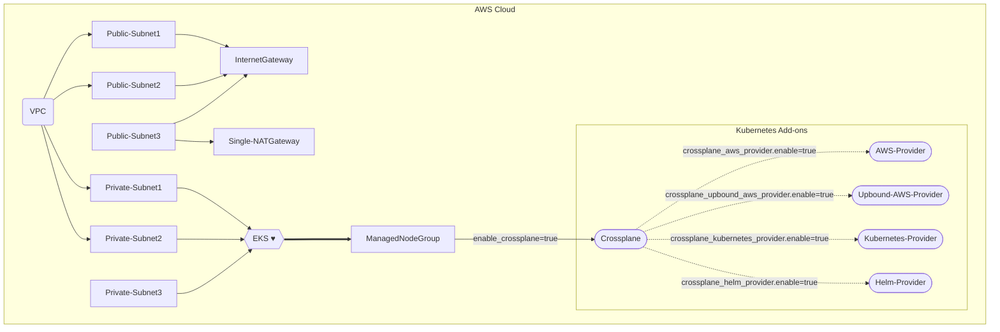

# EKS Cluster bootstrap with Terraform for Crossplane

This example deploys the following components
- Creates a new sample VPC, Two Private Subnets and Two Public Subnets
- Creates Internet gateway for Public Subnets and NAT Gateway for Private Subnets
- Creates EKS Cluster Control plane with one managed node group
- Crossplane Add-on to EKS Cluster
- AWS Provider for Crossplane
- Kubernetes Provider for Crossplane

## Crossplane Deployment Design



## How to Deploy
### Prerequisites:
Ensure that you have installed the following tools in your Mac or Windows Laptop before start working with this module and run Terraform Plan and Apply
1. [AWS CLI](https://docs.aws.amazon.com/cli/latest/userguide/install-cliv2.html)
3. [Kubectl](https://Kubernetes.io/docs/tasks/tools/)
4. [Terraform >=v1.0.0](https://learn.hashicorp.com/tutorials/terraform/install-cli)

### Deployment Steps
#### Step1: Clone the repo using the command below

```shell script
git clone https://github.com/aws-samples/crossplane-aws-blueprints.git
```

#### Step2: Run Terraform INIT
Initialize a working directory with configuration files

```shell script
cd bootstrap/terraform/
terraform init
```

#### Step3: Run Terraform PLAN
Verify the resources created by this execution

```shell script
export TF_VAR_region=<ENTER YOUR REGION>   # Select your own region
terraform plan
```

#### Step4: Finally, Terraform APPLY
to create resources

```shell script
terraform apply
```

Enter `yes` to apply

### Configure `kubectl` and test cluster
EKS Cluster details can be extracted from terraform output or from AWS Console to get the name of cluster.
This following command used to update the `kubeconfig` in your local machine where you run kubectl commands to interact with your EKS Cluster.

#### Step5: Run `update-kubeconfig` command

`~/.kube/config` file gets updated with cluster details and certificate from the below command
```shell script
aws eks --region <enter-your-region> update-kubeconfig --name <cluster-name>
```
#### Step6: List all the worker nodes by running the command below
```shell script
kubectl get nodes
```
#### Step7: Verify the pods running in `crossplane-system` namespace
```shell script
kubectl get pods -n crossplane-system
```
#### Step8: Verify the names provider and provider configs
Run the following command to get the list of providers:
```shell script
kubectl get providers
```
The expected output looks like this:
```
NAME                  INSTALLED   HEALTHY   PACKAGE                                                         AGE
aws-provider          True        True      xpkg.upbound.io/crossplane-contrib/provider-aws:v0.36.0         36m
kubernetes-provider   True        True      xpkg.upbound.io/crossplane-contrib/provider-kubernetes:v0.6.0   36m
provider-helm         True        True      xpkg.upbound.io/crossplane-contrib/provider-helm:v0.13.0        36m
upbound-aws-provider  True        True      xpkg.upbound.io/upbound/provider-aws:v0.27.0                    36m
```
Run the following commands to get the list of provider configs:
```shell script
kubectl get provider
```
The expected output looks like this:
```
NAME                                                   AGE
providerconfig.aws.crossplane.io/aws-provider-config   36m

NAME                                        AGE
providerconfig.helm.crossplane.io/default   36m

NAME                                                                 AGE
providerconfig.kubernetes.crossplane.io/kubernetes-provider-config   36m
```

#### Step9: Access the ArgoCD UI
Get the load balancer url:
```
kubectl -n argocd get service argo-cd-argocd-server -o jsonpath="{.status.loadBalancer.ingress[*].hostname}{'\n'}"
```
Copy and paste the result in your browser.<br>
The initial username is `admin`. The password is autogenerated and you can get it by running the following command:
```
echo "$(kubectl -n argocd get secret argocd-initial-admin-secret -o jsonpath="{.data.password}" | base64 -d)"
```

## How to Destroy
The following command destroys the resources created by `terraform apply`

Step1: Delete resources created by Crossplane

Step2: Terraform Destroy

```bash
./destroy.sh
```
