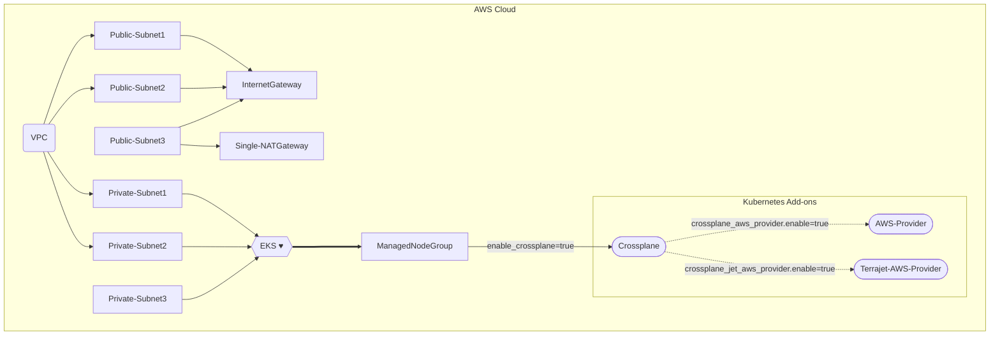

# EKS Cluster bootstrap with Terraform for Crossplane

This example deploys the following components
- Creates a new sample VPC, Two Private Subnets and Two Public Subnets
- Creates Internet gateway for Public Subnets and NAT Gateway for Private Subnets
- Creates EKS Cluster Control plane with one managed node group
- Crossplane Add-on to EKS Cluster
- AWS Provider for Crossplane
- Terrajet AWS Provider for Crossplane

## Crossplane Deployment Design



## How to Deploy
### Prerequisites:
Ensure that you have installed the following tools in your Mac or Windows Laptop before start working with this module and run Terraform Plan and Apply
1. [AWS CLI](https://docs.aws.amazon.com/cli/latest/userguide/install-cliv2.html)
3. [Kubectl](https://Kubernetes.io/docs/tasks/tools/)
4. [Terraform >=v1.0.0](https://learn.hashicorp.com/tutorials/terraform/install-cli)

### Deployment Steps
#### Step1: Clone the repo using the command below

```shell script
git clone https://github.com/aws-samples/crossplane-aws-blueprints.git
```

#### Step2: Run Terraform INIT
Initialize a working directory with configuration files

```shell script
cd bootstrap/terraform/
terraform init
```

#### Step3: Run Terraform PLAN
Verify the resources created by this execution

```shell script
export AWS_REGION=<ENTER YOUR REGION>   # Select your own region
terraform plan
```

#### Step4: Finally, Terraform APPLY
to create resources

```shell script
terraform apply
```

Enter `yes` to apply

### Configure `kubectl` and test cluster
EKS Cluster details can be extracted from terraform output or from AWS Console to get the name of cluster.
This following command used to update the `kubeconfig` in your local machine where you run kubectl commands to interact with your EKS Cluster.

#### Step5: Run `update-kubeconfig` command

`~/.kube/config` file gets updated with cluster details and certificate from the below command
```shell script
aws eks --region <enter-your-region> update-kubeconfig --name <cluster-name>
```
#### Step6: List all the worker nodes by running the command below
```shell script
kubectl get nodes
```
#### Step7: Verify the pods running in `crossplane-system` namespace
```shell script
kubectl get pods -n crossplane-system
```

## How to Destroy
The following command destroys the resources created by `terraform apply`

Step1: Delete resources created by Crossplane

Step2: Terraform Destroy

```shell script
cd bootstrap/terraform/
terraform destroy --auto-approve
```
