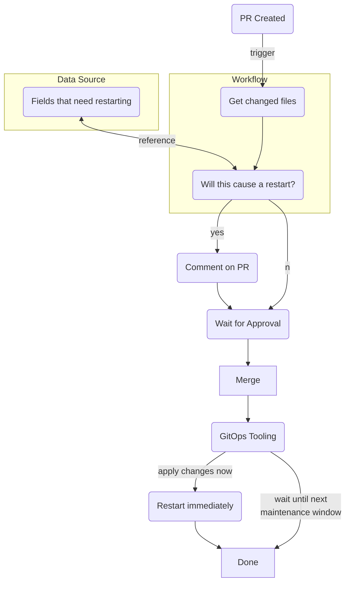
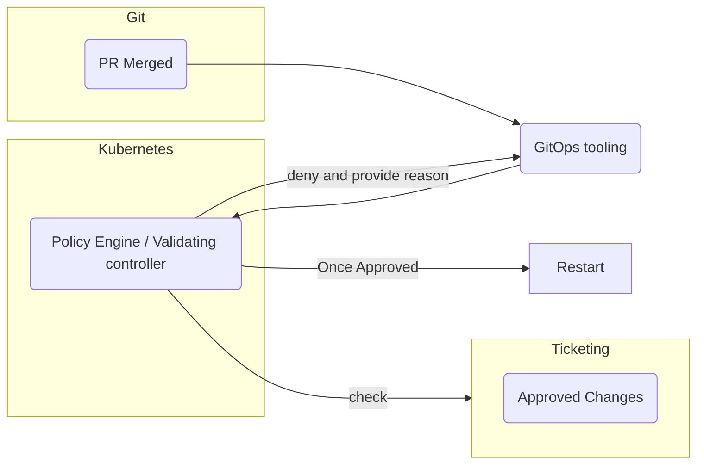
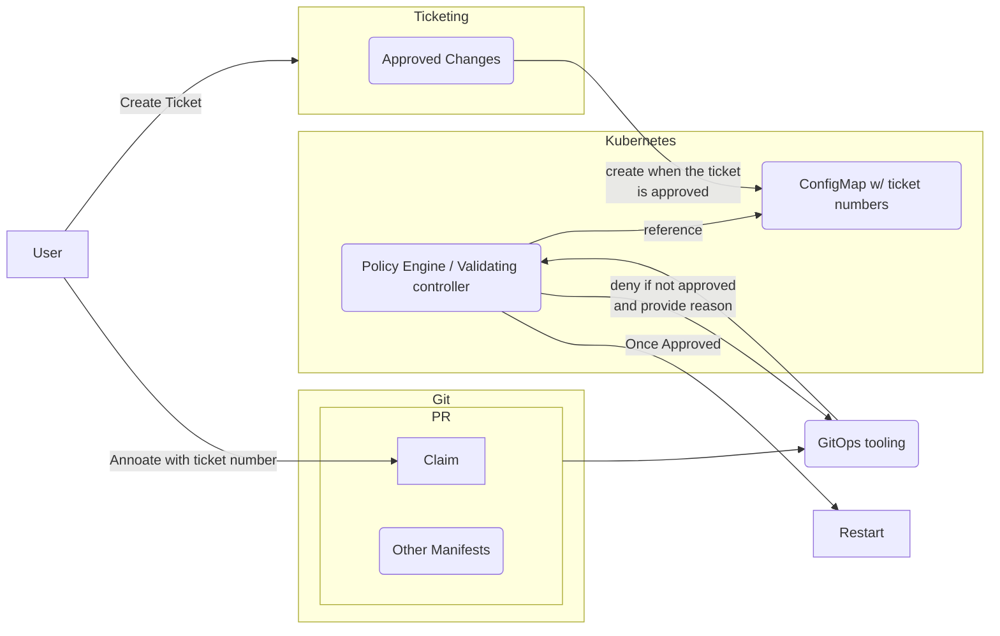

# RDS day 2 operations 


## Background and problem statement


Managing databases can be challenging because they are stateful, not easily replaceable, and data loss could have significant business impacts. 
An unexpected restart could cause havoc to applications that depend on them. 
Because of this, database users and administrators want to offload the management, maintenance, and availability of databases to another entity such as cloud providers. Amazon RDS is one of such services.
Crossplane AWS provider aims to create building blocks for self-service experience for developers by providing abilities to manage AWS resources in Kubernetes native ways. 

In Amazon RDS some operations require an instance restart. For example, version upgrade and storage size modification require an instance restart. RDS attempts to minimize impact of such operations by:
1. Define a scheduled maintenance window.
2. Queue changes that you want to make. Note that these changes may not need restarts.
3. During the next scheduled maintenance window, changes are applied.

This approach is fundamentally different from GitOps. In GitOps, when a change is checked into your repository, it is expected that actual resources are to match the specifications provided in the repository. 

RDS supports applying these changes immediately instead of waiting for a scheduled maintenance window, and when using Crossplane AWS providers, they have [the option](https://marketplace.upbound.io/providers/crossplane-contrib/provider-aws/v0.37.1/resources/rds.aws.crossplane.io/DBInstance/v1alpha1#doc:spec-forProvider-applyImmediately) to [apply changes immediately](https://marketplace.upbound.io/providers/upbound/provider-aws/v0.29.0/resources/rds.aws.upbound.io/Instance/v1beta1#doc:spec-forProvider-applyImmediately) as well. 
This is the option that should be used when using RDS with GitOps. However this leads to problems when enabling self service model where developers can provision resources on their own. 

There are some problems when using the apply immediately option.  
- Updates made to certain fields would need a restart to take effect but this information may not be surfaced back to users. For example, changing the parameter group on an instance requires a restart but this information is not available in the Upbound Official provider. The community provider surface this information in a status field. In both providers, the status fields indicates `Available` and `ReconcileSuccess`. This could give end users an illusion of successful parameter changes, but in reality it has not taken effect yet. 
- Some field changes triggers an instance restart. For example, changing the instance class triggers a restart and potentially cause an outage. Developers may not know which fields would cause restarts because they are not familiar with underlying technologies. You could document potentially dangerous fields, but it is not enough to reliably stop it from happening.

The main goal of this document is to provide guidance on how to provide guardrails for end users when managing RDS resources through Crossplane.

## Parameter Groups
[Parameter Groups](https://docs.aws.amazon.com/AmazonRDS/latest/UserGuide/USER_WorkingWithParamGroups.html) define how the underlying database engine is configured. For example, if you wish to change the `binlog_cache_size` configuration value for your MySQL database, you can do that through parameter groups. 
A parameter group is not limited to be used by a single RDS instance. A parameter group can be used by multiple RDS instances. 

In Parameter Groups, there are two types of parameters: dynamic and static. Dynamic parameters do not require a restart for their values to be applied to the running instance / cluster.  Static parameters require a restart for their values to be applied. 
Additionally, dynamic parameters support specifying how changes to them are applied. When `immediate` is specified the changes to dynamic parameters are applied immediately. When `pending-reboot` is specified, the changes to dynamic parameters are applied during next restart or during the next maintenance window, whichever is earlier. 

Since static parameters do not support `immediate` apply option, specifying this in your composition could lead to some unexpected errors. Therefore, extra care should be taken when exposing this resource to your end users. End users may not be aware of underlying engine specifications.

Summarizing everything above effectively means there are a few general approaches to managing RDS configuration changes. 

1. You want to ensure that parameter group values in the running cluster / instance match what is defined in your Git repository with no delay. The only certain way do this is by restarting the cluster/ instance during the reconciliation process.
2. You can wait for parameter group changes to be applied during the next maintenance window. This means you may need to wait maximum 7 days for the changes to be applied. 
3. The change does not have to be applied immediately but it needs to happen sooner than 7 days. This requires a separate workflow to restart cluster / instance.
4. Use the RDS Blue Green deployment feature.

For reference, problems encountered during parameter group updates in ACK and Terraform are discussed in [this issue](https://github.com/aws-controllers-k8s/community/issues/869) and [this blog post](https://tech.instacart.com/terraforming-rds-part-3-9d81a7e2047f). 

## Solutions

### Considerations
As of writing this doc, there are 9 fields that require a restart to take effect when using a single RDS instance. There are 3 fields that require a restart when using multi-AZ instances. Unfortunately there is no native way to get these fields programmatically.

There are 188 static parameters in `mysql8.0` family, and similar number of them are in other parameter group families as well. You can get a list of static parameters by using the `aws rds describe-engine-default-parameters` command. 

These fields and parameters need to be stored for use by whatever check mechanism you choose, and they need to be updated regularly.

It is also worth pointing out that when a user updates a parameter in a parameter group, the changes to parameter groups themselves usually work without problems. However, it is often not the intention of these changes. The intention of changes is to change the parameter and apply it to a running instance. In both providers, changes to static parameters are not actually applied until the next maintenance window or a manual restart is issued. 

We will discuss a few approaches to this problem below. **Whichever approach you choose, it is important for the check mechanisms to work reliably. It's easy to lose users' trust when checks say there will be a restart but no restart happened. Or worse, checks did not detect potential restarts and caused an outage.**

### Check during PR
Use Pull Request as a checkpoint and ensure developers are aware of potential consequences of the changes. An example process may look something like the following. 



In this example, whenever a pull request is created, a workflow is executed and a comment is created on the PR warning the developers of potential impacts. When developers approve the PR, it implies that they are aware of consequences.
To check if a PR is impacted, you can use of the following options:
- Parse git diff and search for changes to "dangerous" fields
- Use `kubectl diff` then look for changes to "dangerous" fields. This requires read access to the target cluster but more accurate.


### Check at runtime

Another approach is to deny such operation at runtime using a policy engine and/or custom validating web hook unless certain conditions are met. This means problems with RDS configuration is communicated to the developers through their GitOps tooling by providing reasons for denial.
Note that it is a good idea to check at runtime even if you have a check during PR.

#### Example 1 



In the example above, no check is performed during PR. During admission into the Kubernetes cluster, a validating controller will reach out to the ticketing system and verify if this change is approved. If no ticket associated with this change is approved, it's rejected with provided reason. 

Note that ticketing system here is just an example. It can be any type of systems that provides a decision.

#### Example 2


In this example, developer creates a ticket in the ticketing system and annotates the infrastructure claim with the ticket number. The admission controller checks if the change affects fields that require approval. If approval is required, the change is denied until the ticket is approved and the reason is given back to the GitOps tooling. 

Once the ticket is approved, a config map is created with the ticket number as its name or as one of annotations. Next time the GitOps tooling attempts to apply manifests, the admission controller sees the ConfigMap is now created and allows it to be deployed. Once it is deployed, the ConfigMap can be marked for deletion. In this approach, there is no need for read access to the ticketing system. 


## Blue Green deployment
RDS added native support for blue green deployment. This allows for safer database updates because RDS manages the process of creating an alternate instance, copying data over to it, and shifting traffic to it.

As of writing this doc, neither providers support this functionality. Because the functionality is available in [Terraform](https://registry.terraform.io/providers/hashicorp/aws/latest/docs/resources/db_instance#blue_green_update), the Upbound official provider should be able to support this in the future.
In addition, this functionality is supported for MariaDB and MySQL only.


## Break glass scenarios
In case of an emergency where something unexpected ocurred and you need to stop providers from making changes to AWS resources, you can use one of the following methods: 
- To prevent providers from making changes to a specific resource, you can use the `crossplane.io/paused` annotation. e.g. 
    ```bash
    kubectl annotate instance.rds.aws.upbound.io my-instance crossplane.io/paused=true
    ```
- To prevent providers from making changes to ALL of your resources, you can update the number of replicas in ControllerConfig to 0. This will terminate the running pod. e.g.
    ```yaml
    apiVersion: pkg.crossplane.io/v1alpha1
    kind: ControllerConfig
    spec:
      replicas: 0 # This value is usually 1. 
    ```
- If you cannot access the cluster, you can prevent providers from making changes to all or some of your resources by either removing the policy associated with the IAM role or adjusting the policy to allow it to make changes to certain resources only.

# References
https://docs.aws.amazon.com/AmazonRDS/latest/UserGuide/Overview.DBInstance.Modifying.html

https://docs.aws.amazon.com/AmazonRDS/latest/UserGuide/modify-multi-az-db-cluster.html

https://docs.aws.amazon.com/AmazonRDS/latest/UserGuide/blue-green-deployments-overview.html

https://registry.terraform.io/providers/hashicorp/aws/latest/docs/resources/db_instance#blue_green_update
