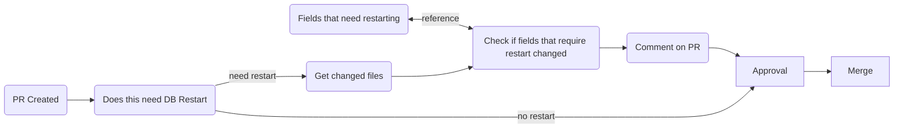
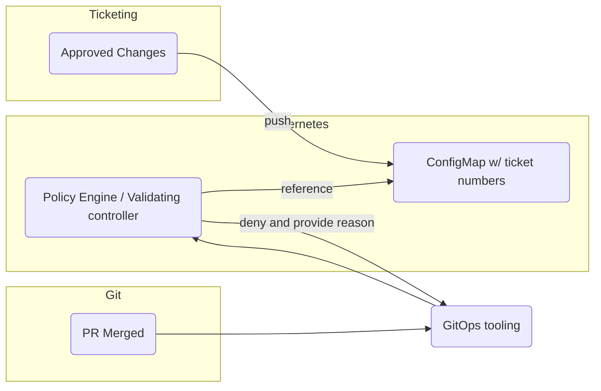

# RDS day 2 operations 

## Background and problem statement

Managing databases can be challenging because they are stateful, not easily replaceable, and data loss could have significant business impact. An unexpected restart could cause havoc to applications that depend on them. Because of this, people want to offload management, maintenance, and availability of databases to another entity such as cloud providers. Amazon RDS is one of such services. 
Crossplane AWS provider aims to create building blocks for self-service experience for developers by providing abilities to manage AWS resources in Kubernetes native ways. 

In Amazon RDS some operations require an instance restart. For example, version upgrade and storage size modification require an instance restart. RDS attempts to minimize impact of such operations by:
1. Define a scheduled maintenance window.
2. Queue changes that you want to make.
3. During the next scheduled maintenance window, changes are applied.

This approach is fundamentally different from GitOps. In GitOps, when a change is checked into your repository, it is expected that actual resources are to match the specifications provided in the repository. 

RDS supports applying these changes immediately instead of waiting for a scheduled maintenance window, and when using Crossplane AWS providers, they have the option to apply changes immediately as well. This is the option that should be used when using RDS with GitOps. However this leads to problems when enabling self service model where developers can provision resources on their own. 

One of most notable problems is that updates made to certain fields could trigger database restarts. Developers may not know which fields would cause restarts because they are not familiar with underlying technologies. You could document potentially dangerous fields, but it is not enough to reliably stop it from happening. 

## Parameter Groups
[Parameter Groups](https://docs.aws.amazon.com/AmazonRDS/latest/UserGuide/USER_WorkingWithParamGroups.html) define how the underlying database engine is configured. For example you may wish to change the `binlog_cache_size` configuration value for your MySQL database. 

In Parameter Groups, there are two types of parameters: dynamic and static.
Dynamic parameters do not require a restart for their values to be applied to the running instance / cluster.  Static parameters require a restart for their values to be applied. Additionally, dynamic parameters support specifying how changes to them are applied. When `immediate` is specified the changes to dynamic parameters are applied immediately. When `pending-reboot` is specified, the changes to dynamic parameters are applied during next restart or during the next maintenance window, whichever is earlier. 

Since static parameters do not support `immediate` apply option, specifying this in your composition could lead to some unexpected error. Therefore, extra care should be taken when exposing this resource to your end users. End users may not be aware of underlying engine specifications.

This effectively means there are a few general approaches to managing RDS configuration changes. 
1. You want to ensure that parameter group values in running cluster / instance match what is defined in your Git repository with no delay. The only sure way to ensure that is restarting the cluster/ instance during the reconciliation process. 
2. You can wait for parameter group changes to be applied during the next maintenance window. This means you may need to wait maximum 7 days for the changes to be applied. 
3. The change does not have to be applied immediately but it needs to happen sooner than 7 days. This requires a separate workflow to restart cluster / instance. 

For reference, problems encountered during parameter group update in ACK and Terraform are discussed in [this issue](https://github.com/aws-controllers-k8s/community/issues/869) and [this blog post](https://tech.instacart.com/terraforming-rds-part-3-9d81a7e2047f). 

## Solutions

### Check during PR
Use Pull Request as a checkpoint and ensure developers are aware of potential consequences of the changes. An example process may look something like the following. 

In this example, whenever a pull request is created, a workflow is executed and a comment is created on the PR warning the developers of potential impacts. When developers approve the PR, it implies that they are aware of consequences.
To check if a PR is impacted, you can use of the following options:
- Parse git diff and search for changes to "dangerous" fields
- Use `kubectl diff` then look for changes to "dangerous" fields. This requires read access to the target cluster but more accurate.

In this approach, it is important for the check mechanisms to work reliably. It's easy to lose developers' trust when checks say there will be restarts but no restart happened. Or worse, checks did not detect potential restarts and caused an outage.

### Check at runtime

Another approach is to deny such operation at runtime using a policy engine and/or custom validating web hook unless certain conditions are met. This means problems with RDS configuration is communicated to the developers through their GitOps tooling by providing reasons for denial.

In the example above, no check is performed during PR. During admission into the Kubernetes cluster, a validating controller will lookup config map which contain ticket number and validate the request is valid. If no ticket number associated with this change is approved, it's rejected with provided reason. 

## Blue Green deployment
RDS added native support for blue green deployment. This allows for safer database updates because RDS manages the process of creating an alternate instance, copying data over to it, and shifting traffic to it.

As of writing this doc, neither providers support this functionality. Because the functionality is available in [Terraform](https://registry.terraform.io/providers/hashicorp/aws/latest/docs/resources/db_instance#blue_green_update), the Upbound official provider should be able to support this in the future.
In addition, this functionality is supported for MariaDB and MySQL only.

## Major version upgrade 
Talk about:
- Upgrading from backups
- Backup strategy / frequency
- Specify snapshots when creating new instances

## Break glass scenarios
- How to stop Crossplane from reconciling specific resources
- How to stop Crossplane aws provider all together

# References
https://docs.aws.amazon.com/AmazonRDS/latest/UserGuide/Overview.DBInstance.Modifying.html

https://docs.aws.amazon.com/AmazonRDS/latest/UserGuide/modify-multi-az-db-cluster.html

https://docs.aws.amazon.com/AmazonRDS/latest/UserGuide/blue-green-deployments-overview.html

https://registry.terraform.io/providers/hashicorp/aws/latest/docs/resources/db_instance#blue_green_update
