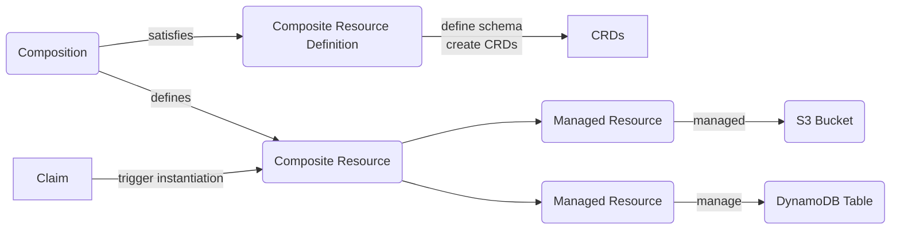
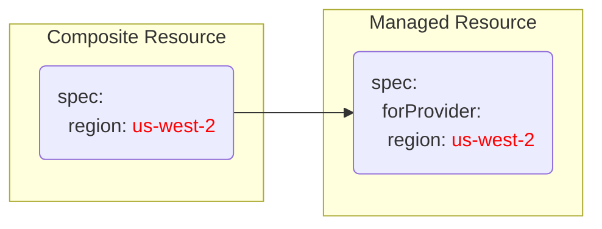
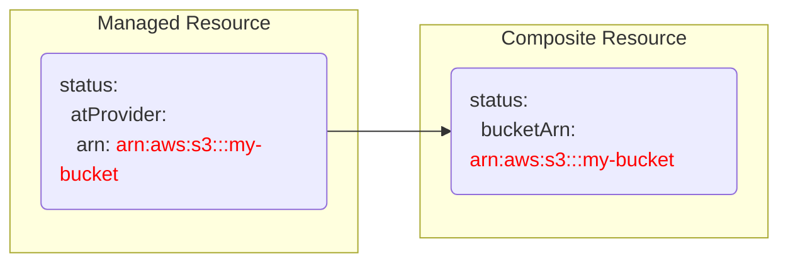
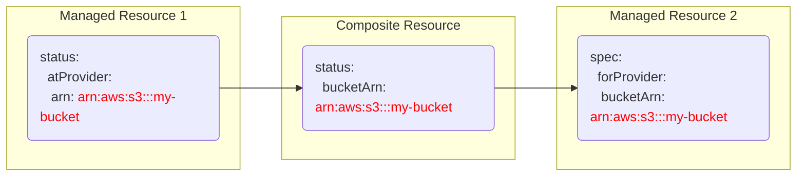
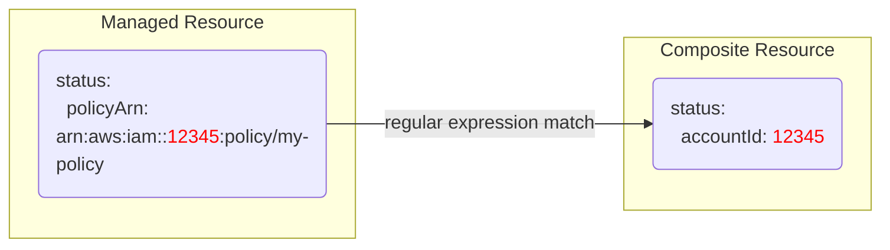

## Crossplane Patching Basics
### Component relationships


#### From Composite Resource to Managed Resource

Crossplane compositions allow you to modify sub resources based on arbitrary fields from their composite resource. This type of patches are referred as `FromCompositeFieldPath`. Take for an example:

```yaml
type: FromCompositeFieldPath
fromFieldPath: spec.region
toFieldPath: spec.forProvider.region
```

This tells Crossplane to:
1. Look at the `spec.region` field in the Composite Resource.
2. Then copy that value into the `spec.forProvider.region` field in this instance of managed resource.




#### From Managed Resource to Composite Resource

Compositions also allow you to modify the composite resource from its sub resources. 
For example:

```yaml
type: ToCompositeFieldPath
fromFieldPath: status.atProvider.arn
toFieldPath: status.bucketArn
policy:
  fromFieldPath: Optional # This can be omitted since it defaults to Optional.
```

This tells Crossplane to:
1. Look at the `status.atProvider.arn` field on the managed resource.
2. If the `status.atProvider.arn` field is empty, skip this patch.
3. Copy the value into the `status.bucketArn` field on the composite resource. 



#### Putting them together

With these patching methods together, you can pass values between managed resources.

```yaml
type: FromCompositeFieldPath
fromFieldPath: status.bucketArn
toFieldPath: spec.forProvider.bucketArn
policy:
  fromFieldPath: Required
```

This tells Crossplane to:
1. Look at the `status.bucketArn` field in the Composite Resource.
2. If the `status.bucketArn` field is empty, do not skip. Stop composing this managed resource.
3. Once the `status.bucketArn` field is filled with a value, copy that value into the `spec.forProvider.bucketArn` in the managed resource.

With the use of `Required` policy, you can create a soft dependency. This is useful when you do not want to create a resource before another resource is ready.



#### Transform
You can also perform modifications to values when patching. For example, you can use the following transformation to extract the accountId of this managed policy.

```yaml
type: ToCompositeFieldPath
fromFieldPath: status.policyArn
toFieldPath: status.accountId
transforms:
  - type: string
    string:
      type: Regexp
      regexp:
        match: 'arn:aws:iam::(\d+):.*'
        group: 1
```

This tells Crossplane to:
1. Look at the `status.policyArn` field in the Managed Resource.
2. If the field has a value, take that value and run a regular expression match against it.
3. When there is a match, take the first capture group and store it in the `status.accountId` field in the Composite Resource.



## Reference
See the official documentation for more information.
https://docs.crossplane.io/master/concepts/composition/#patch-types
