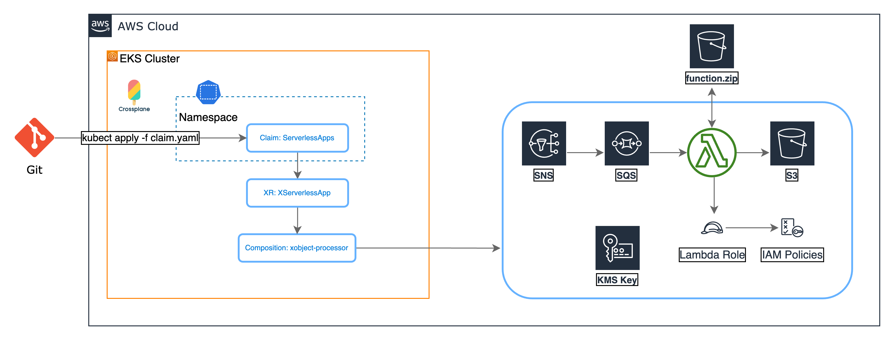

# Upbound AWS Provider Crossplane Blueprint Examples
This folder contains examples for deploying AWS resources using the following provider and related specs

- [Upbound AWS Provider](https://github.com/upbound/provider-aws)
- [CRDs specs](https://marketplace.upbound.io/providers/upbound/provider-aws/)

## Pre-requisites:
 - EKS Cluster bootstrap deployment
 - Crossplane deployment in bootstrap cluster
 - ProviderConfig deployment with injected identity

Follow these links to bootstrap the cluster
- Bootstrap the cluster with [Terraform](../../bootstrap/terraform/README.md)
- Bootstrap the cluster with [eksctl](../../bootstrap/eksctl/README.md)


## Create managed resources to validate Upbound AWS Provider configuration
The following steps demonstrates VPC end S3 managed resources examples with **Upbound AWS Provider**


### Deploy VPC Managed Resource for Upbound AWS Provider

```shell
kubectl apply -f managed-resources/ec2/vpc.yaml

# Verify the resource. When provisioning is complete, you should see READY: True in the output
kubectl get vpcs
```

### Deploy S3 Managed Resource for Upbound AWS Provider
TODO: change `name: my-bucket` to `generateName: upbound-test-bucket-`

```shell
kubectl create -f managed-resources/s3/bucket.yaml

# Verify the resource. When provisioning is complete, you should see READY: True in the output
kubectl get buckets
```

## Deploy the serverless app example
This example deploys the architecture depicted on the diagram.


### Deploy XRDs and Compositions

```shell
kubectl apply -k ../../compositions/upbound-aws-provider/
```

Verify the XRDs
```
kubectl get xrds
```
Expected output
```
NAME                                   ESTABLISHED   OFFERED   AGE
eventsourcemappings.awsblueprints.io   True                    5m
iampolicies.awsblueprints.io           True                    5m
xencryptionkeys.awsblueprints.io       True          True      5m
xfanouts.awsblueprints.io              True          True      5m
xlambdafunctions.awsblueprints.io      True          True      5m
xnotifications.awsblueprints.io        True          True      5m
xobjectstorages.awsblueprints.io       True          True      5m
xqueues.awsblueprints.io               True          True      5m
xserverlessapp.awsblueprints.io        True          True      5m
```

Verify the Compositions
```
kubectl get compositions
```
Expected output
```
k get compositions
NAME                                            AGE
container.lambda.aws.upbound.awsblueprints.io   5m
read-kms.iampolicy.awsblueprints.io             5m
read-s3.iampolicy.awsblueprints.io              5m
read-sqs.iampolicy.awsblueprints.io             5m
s3.lambda.aws.upbound.awsblueprints.io          5m
s3bucket.awsblueprints.io                       5m
sns.notification.upbound.awsblueprints.io       5m
sqs.esm.awsblueprints.io                        5m
sqs.queue.aws.upbound.awsblueprints.io          5m
write-s3.iampolicy.awsblueprints.io             5m
write-sqs.iampolicy.awsblueprints.io            5m
xencryptionkeys-kms.awsblueprints.io            5m
xfanout.awsblueprints.io                        5m
xobject-processor.awsblueprints.io              5m
```

### Prepare Lambda Function code
#### Pre-requisites:
- Go is installed. Find the installation instructions [here](https://go.dev/doc/install).
- AWS CLI is installed and configured. Find the installation instructions [here](https://docs.aws.amazon.com/cli/latest/userguide/getting-started-install.html).

#### Build, zip, and upload golang function code to s3
Navigate to the function code folder
```
cd composite-resources/serverless/app/
```
Executing the `build-and-upload-zip.sh` script creates an S3 bucket in a specified region, builds and zips the Go function, and uploads the ZIP file to the S3 bucket. If the bucket already exists and you have access to it, the script will print a message and continue with the upload. If the options are not specified, the script will use the values of the S3_BUCKET and REGION environment variables.
```
export S3_BUCKET=<unique-s3-bucket-name>
export REGION=<region>
./build-and-upload-zip.sh
```
Or you can just pass bucket name and region as options
```
./build-and-upload-zip.sh --bucket <unique-s3-bucket-name> --region <region>
```

#### Update and apply the claim
```
cd ../
```
Replace the bucket name and region in the claim with the ones in the previous step
```
sed -i -e "s/replace-with-unique-s3-bucket/$S3_BUCKET/" serverless-processor-claim.yaml
sed -i -e "s/replace-with-aws-region/$REGION/" serverless-processor-claim.yaml
```
Apply the claim
```
kubectl apply -f serverless-processor-claim.yaml
```
Validate the claim
```
kubectl get serverlessapp
```
Expected result (it might take sometime before READY=True)
```
NAME              SYNCED   READY   CONNECTION-SECRET   AGE
test-serverless   True     True                        20m
```

#### Test
Use the following command to get the SNS topic ARN and store it in $SNS_TOPIC_ARN environment variable
```
SNS_TOPIC_ARN=$(aws sns list-topics |jq -r '.Topics | map(select(.TopicArn | contains("function-sns-sqs-test-serverless"))) | .[0].TopicArn' | tr -d '[:space:]')
```
The command will only store the first topic that contains `function-sns-sqs-test-serverless` in the name. Validate you have the correct topic:
```
echo $SNS_TOPIC_ARN
```
Publish a message to the topic.
```
aws sns publish --topic-arn $SNS_TOPIC --message abc
```
Navigate to the AWS console and observe the message getting passed to the SQS, triggering the Lambda, and publishing the result in the S3 bucket.

## Clean Up
Delete the serverless application
```
kubectl delete -f serverless-processor-claim.yaml
```
Delete the bucket
```
aws s3 rm s3://${S3_BUCKET}/function.zip
aws s3api delete-bucket --bucket ${S3_BUCKET} # This will fail when the bucket is not empty.
```
Delete the XRDs and Compositions
```
kubectl delete -k ../../../../compositions/upbound-aws-provider/
```
