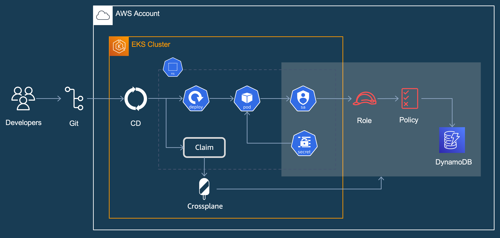

# Example to deploy dynamo-irsa application
This example deploys the archtecture depicted on the diagram. First, it applies the Crossplane XRDs and Composition. Then it applies an ArgoCD helm chart that contains the Crossplane Claim and a deployment. The Crossplane creates the dynamoDB Table and IRSA resources, then the deployment contains an aws-cli pod that adds items to the table and retrieves them in a loop to validate the IRSA connection works.



## Pre-requisites
 - [Upbound AWS Provider Crossplane Blueprint Examples](../../../README.md)


### Deploy XRDs and Compositions
```shell
kubectl apply -k .
```

Verify the XRDs
```shell
kubectl get xrds
```

Expected output
```
NAME                               ESTABLISHED   OFFERED   AGE
iampolicies.awsblueprints.io       True                    5m
xdynamodbtables.awsblueprints.io   True          True      5m
xdynamoirsas.awsblueprints.io      True          True      5m
xirsas.awsblueprints.io            True          True      5m
```

Verify the Compositions
```shell
kubectl get compositions
```

Expected output. Note: the output might contain more compositions but these are the ones uses by the claim in the next step
```
NAME                                                  XR-KIND              XR-APIVERSION               AGE
irsa.awsblueprints.io                                 XIRSA                awsblueprints.io/v1alpha1   5m
table.dynamodb.awsblueprints.io                       XDynamoDBTable       awsblueprints.io/v1alpha1   5m
write-dynamodb.iampolicy.awsblueprints.io             IAMPolicy            awsblueprints.io/v1alpha1   5m
xdynamoirsa.awsblueprints.io                          XDynamoIRSA          awsblueprints.io/v1alpha1   5m
```

### Validate `EnvironmentConfig`

Crossplane `environmentconfig` named `cluster` is created by the bootstrap terraform code. Validate it exists and contains proper values
```
kubectl get environmentconfig cluster -o yaml
```
Expected output
```
apiVersion: apiextensions.crossplane.io/v1alpha1
kind: EnvironmentConfig
metadata:
  name: cluster
data:
  awsAccountID: <account_id>
  eksOIDC: <oidc>
```

### Apply the dynamodb claim
```
kubectl apply -f claim/dynamo-irsa.yaml
```
Wait for the resources to come up and the claim to be ready
```
kubectl get dynamoirsa
```
Expected output
```
NAME               SYNCED   READY   CONNECTION-SECRET   AGE
dynamo-irsa-test   True     True    dynamo-irsa-test    10m
```

### Test
Create a aws-cli pod
```
kubectl apply -f awscli-pod.yaml
```
Exec into the container
```
kubectl exec -it dynamo-irsa -- sh
```
Add an item to the table
```
aws dynamodb put-item --table-name $tableName --item '{"ID":{"S":"1"},"Artist":{"S":"ABBA"},"SongTitle":{"S":"Take A Chance On Me"}}'
```
Get the item
```
aws dynamodb get-item --table-name $tableName --key '{"ID": {"S": "1"}}'
```
Get all items
```
aws dynamodb scan --table-name $tableName
```
### Clean up
Delete the pod and claim
```
kubectl delete po dynamo-irsa
kubectl delete dynamoirsa dynamo-irsa-test
``` 
Delete xrds and compositions
```
kubectl delete -k .
```
