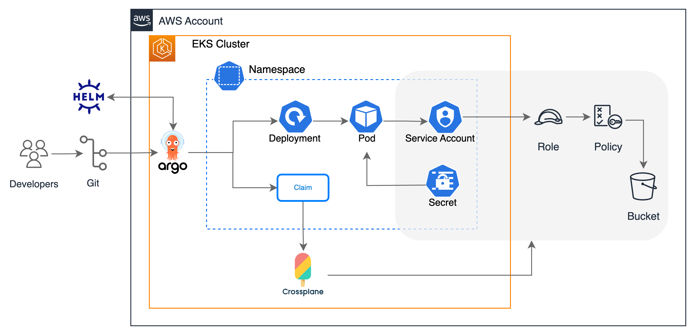
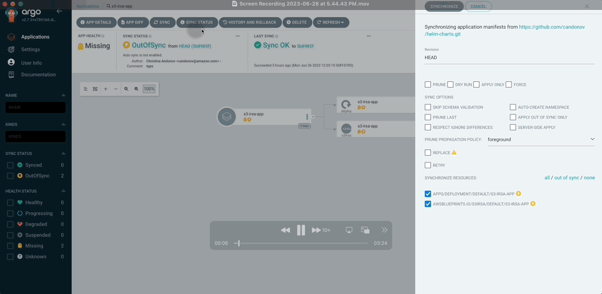

# Example to deploy s3-irsa application
This example deploys the archtecture depicted on the diagram. First, it applies the Crossplane XRDs and Composition. Then it applies an ArgoCD helm chart that contains the Crossplane Claim and a deployment. The Crossplane creates the S3 bucket and IRSA resources, then the deployment contains an aws-cli pod that upload a file to the bucket and list the content of the bucket to validate the IRSA connection works.



## Pre-requisites
 - [Upbound AWS Provider Crossplane Blueprint Examples](../../README.md)


### Deploy XRDs and Compositions
```shell
kubectl apply -k .
```

Verify the XRDs
```shell
kubectl get xrds
```

Expected output
```
NAME                                   ESTABLISHED   OFFERED   AGE
iampolicies.awsblueprints.io           True                    5m
xirsas.awsblueprints.io                True          True      5m
xobjectstorages.awsblueprints.io       True          True      5m
xs3irsas.awsblueprints.io              True          True      5m
```

Verify the Compositions
```shell
kubectl get compositions
```

Expected output. Note: the output might contain more compositions but these are the ones uses by the claim in the next step
```
NAME                                                  XR-KIND              XR-APIVERSION               AGE
irsa.awsblueprints.io                                 XIRSA                awsblueprints.io/v1alpha1   5m
s3bucket.awsblueprints.io                             XObjectStorage       awsblueprints.io/v1alpha1   5m
write-s3.iampolicy.awsblueprints.io                   IAMPolicy            awsblueprints.io/v1alpha1   5m
xs3irsa.awsblueprints.io                              XS3IRSA              awsblueprints.io/v1alpha1   5m
```

### Validate `EnvironmentConfig`

Crossplane `environmentconfig` named `cluster` is created by the bootstrap terraform code. Validate it exists and contains proper values
```
kubectl get environmentconfig cluster -o yaml
```
Expected output
```
apiVersion: apiextensions.crossplane.io/v1alpha1
kind: EnvironmentConfig
metadata:
  name: cluster
data:
  awsAccountID: <account_id>
  eksOIDC: <oidc>
```

### Apply ArgoCD application
The applications contains the claim and the deployment.
```
kubectl apply -f argocd-s3-irsa-app.yaml
```

### Navigate to the ArgoCD UI
Find the ArgoCD URL:
```
kubectl -n argocd get svc argo-cd-argocd-server -o jsonpath='{.status.loadBalancer.ingress[0].hostname}'
```
The username is `admin` and the password can be obtained by executing:
```
kubectl -n argocd get secret argocd-initial-admin-secret -o jsonpath="{.data.password}" | base64 -d
```

### Sync the ArgoCD app and watch the s3-irsa-app come up.


### Check the pod logs to validate the application has access to the bucket

