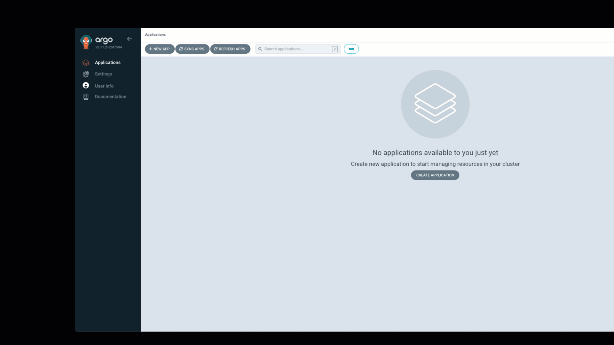
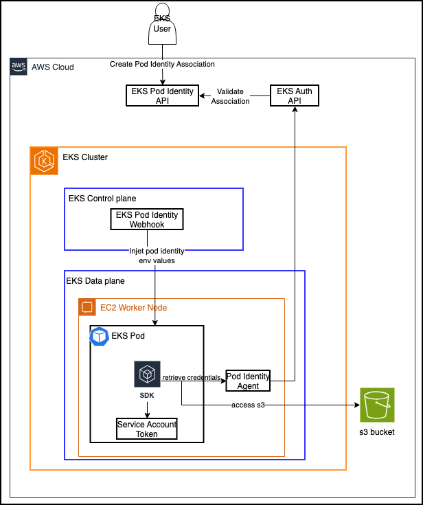
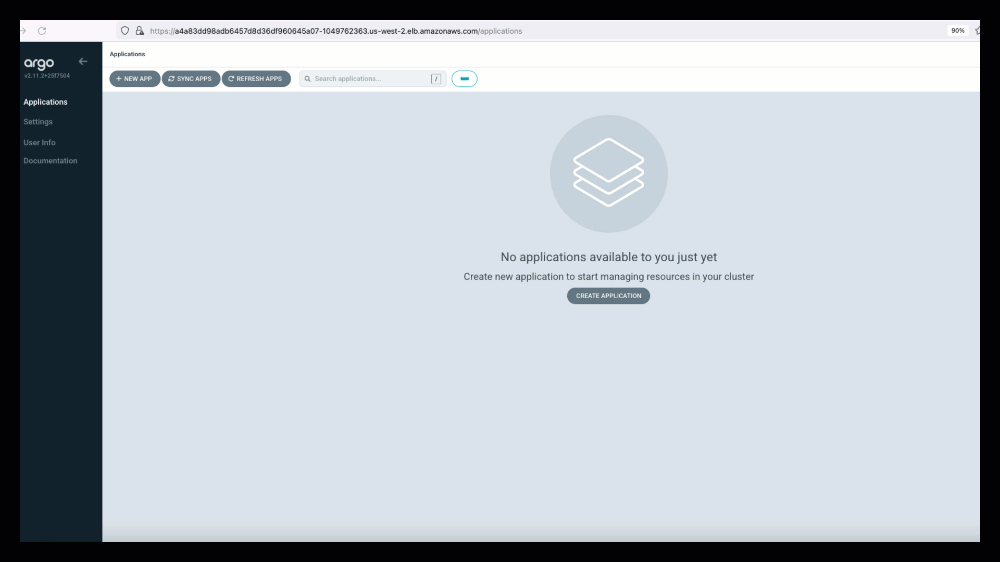

# Example to deploy s3 access application

The example shows how to set up Crossplane to allow secure access to S3 from pods in an EKS cluster


## Pre-requisites
 - [Upbound AWS Provider Crossplane Blueprint Examples](../../README.md)


### Deploy Composite Resource Definations(XRDs) and Compositions
Navigate to /crossplane-on-eks/examples/upbound-aws-provider/composite-resources/s3
```shell
kubectl apply -k .
```

Verify  XRDs
```shell
kubectl get xrds
```

Displays installed XRDs
```
NAME                                   ESTABLISHED   OFFERED   AGE
iampolicies.awsblueprints.io         True                    18h
xirsas.awsblueprints.io              True          True      18h
xobjectstorages.awsblueprints.io     True          True      18h
xpodidentityroles.awsblueprints.io   True          True      18h
xs3irsas.awsblueprints.io            True          True      18h
xs3podidentities.awsblueprints.io    True          True      18h
```

Verify Compositions
```shell
kubectl get compositions
```

Displays installed compositions
```
NAME                                                  XR-KIND            XR-APIVERSION               AGE
irsa.awsblueprints.io                                 XIRSA              awsblueprints.io/v1alpha1   18h
lambda-invoke.iampolicy.awsblueprints.io              IAMPolicy          awsblueprints.io/v1alpha1   18h
read-kms.iampolicy.awsblueprints.io                   IAMPolicy          awsblueprints.io/v1alpha1   18h
read-s3.iampolicy.awsblueprints.io                    IAMPolicy          awsblueprints.io/v1alpha1   18h
read-sqs.iampolicy.awsblueprints.io                   IAMPolicy          awsblueprints.io/v1alpha1   18h
.
.
.
```

<!--### Validate `EnvironmentConfig`-->

<!--Crossplane `environmentconfig` named `cluster` is created by the bootstrap terraform code. Validate it exists and contains proper values-->
<!--```-->
<!--kubectl get environmentconfig cluster -o yaml-->
<!--```-->
<!--Expected output-->
<!--```-->
<!--apiVersion: apiextensions.crossplane.io/v1alpha1-->
<!--kind: EnvironmentConfig-->
<!--metadata:-->
<!--  name: cluster-->
<!--data:-->
<!--  awsAccountID: <account_id>-->
<!--  eksOIDC: <oidc>-->
<!--```-->


The example uses ArgoCD to deploy the pod and crossplane resources. ArgoCD is already installed by Terraform.

ArgoCD URL:
```
kubectl -n argocd get svc argo-cd-argocd-server -o jsonpath='{.status.loadBalancer.ingress[0].hostname}'
```
Use "admin" as the username. Execute the given command to get the password:
```
kubectl -n argocd get secret argocd-initial-admin-secret -o jsonpath="{.data.password}" | base64 -d
```

Kubernetes service accounts act as identities for processes running inside pods. To enable a pod to access AWS services, its service account can be mapped to an IAM role that has the necessary permissions. There are two options for mapping the service account to an IAM role in order to grant AWS access: Amazon EKS Pod Identity and IRSA(Iam Roles for Service Accounts)


<!--::::expand{header="What is GitOps?"}-->
<!--[GitOps](https://www.cncf.io/blog/2021/09/28/gitops-101-whats-it-all-about/) is a way of managing infrastructure and applications using Git as the single source of truth. GitOps watches this Git repository and automatically applies any changes to make the actual state match the desired state in Git-->
<!--::::-->

<details>

<summary>IRSA example</summary>


### Deploy ArgoCD IRSA application

The ArgoCD application deploys a Kubernetes deployment to create a pod, along with Crossplane claims to provision an S3 bucket, service account, and IAM role with S3 write access using IRSA.
```
kubectl apply -f argocd-s3-irsa.yaml
```

### Log in to the ArgoCD UI.

Use the credentials retrieved previously to log in to the ArgoCD UI.

### Validate  pod access to bucket
 It will take few minutes to create the pod. You can review pod logs to verify access to the bucket.



</details>

<details>

<summary>Pod Identity example</summary>




### Deploy ArgoCD Pod Identity application

The ArgoCD application deploys a Kubernetes deployment to create a pod, along with Crossplane claims to provision an S3 bucket, service account, and IAM role with S3 write access using IRSA.
```
kubectl apply -f argocd-s3-podidentity.yaml
```

### Log in to the ArgoCD UI.

Use the credentials retrieved previously to log in to the ArgoCD UI.

### Validate  pod access to bucket
 It will take few minutes to create the pod. You can review pod logs to verify access to the bucket.



</details>
