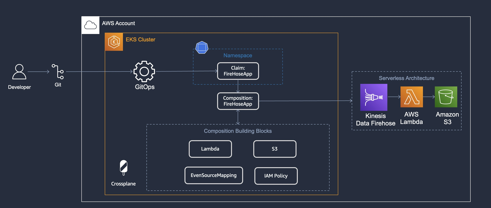
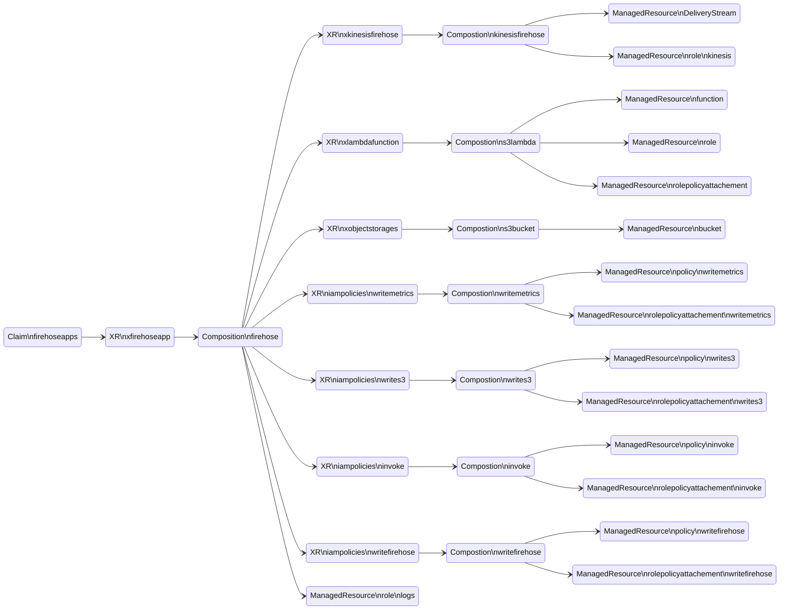
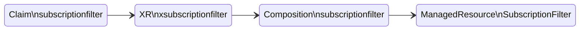
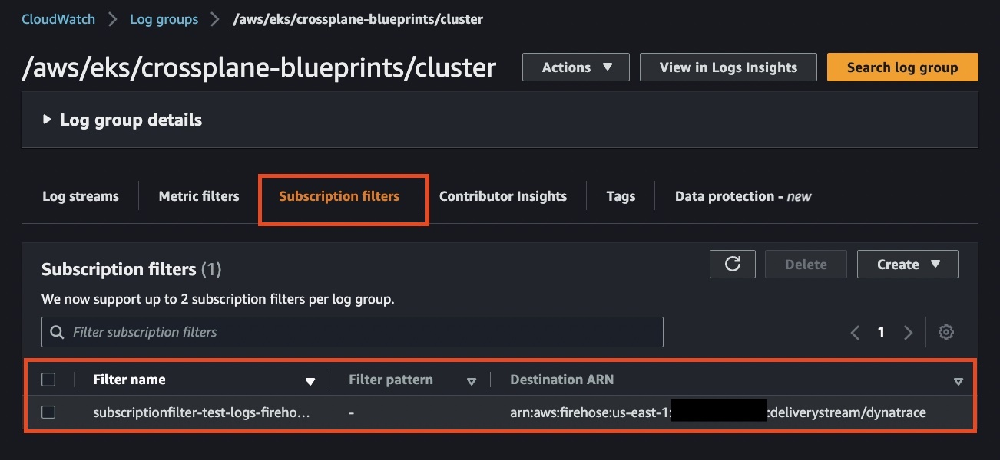
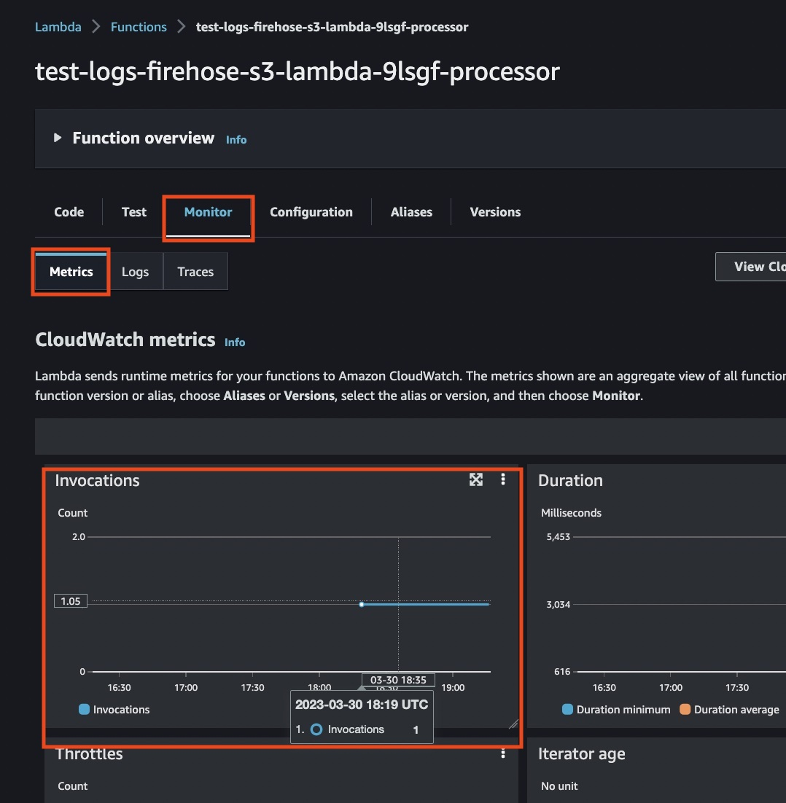
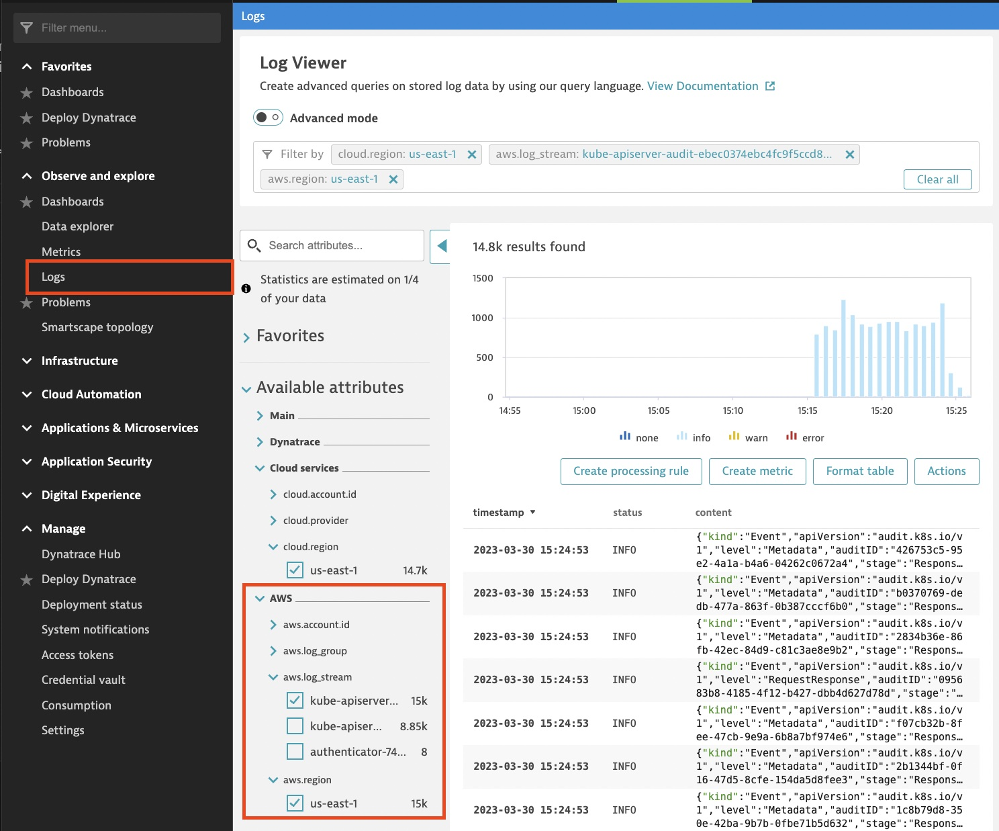

# Example to deploy serverless architecture (kinesis log forwarder)
This example deploys the architecture depicted on the diagram. First, it applies the Crossplane XRD and Compositions. Then it applies the Claim to deploy the log forwarder with the AWS resources (Kinesis Data Firehose steam, S3 bucket, Lambda function), and then it applies a second Claim to subscribe the log forwarder to a CloudWatch log group. Last, it tests the architecture functionality by sending logs to Lambda to be process which forwards the logs to a 3rd party log collector with a copy saved on S3.



> This composition implemets the [github.com/dynatrace-oss/dynatrace-aws-log-forwarder](https://github.com/dynatrace-oss/dynatrace-aws-log-forwarder)

## Pre-requisites:
 - [Upbound AWS Provider Crossplane Blueprint Examples](../../../README.md)

- A Dynatrace account
Dynatrace provides a 16 day free trial. Once you are logged in, create an API Key for log ingestion,
for more information on creating the key and enabling log monitoring see the doc [Amazon CloudWatch Logs monitoring
](https://www.dynatrace.com/support/help/setup-and-configuration/setup-on-cloud-platforms/amazon-web-services/amazon-web-services-integrations/aws-service-metrics/cloudwatch-logs)

Navigate to the Dynatrace console -> "Access Tokens" and generate a token or use the API to generate the token (scope log.ingest) with the following command:
```sh
curl -X POST "https://XXXXXXXX.live.dynatrace.com/api/v2/apiTokens" -H "accept: application/json; charset=utf-8" -H "Content-Type: application/json; charset=utf-8" -d "{\"name\":\"lambda-ingest-logs\",\"scopes\":[\"logs.ingest\"]}" -H "Authorization: Api-Token XXXXXXXX"
```

Create an AWS bucket and upload the dynatrace lambda code, you can download latest version from github repository [github.com/dynatrace-oss/dynatrace-aws-log-forwarder](https://github.com/dynatrace-oss/dynatrace-aws-log-forwarder/releases)

Use the helper script `upload_dynatrace_zip.sh` to download latest zip file lambda, and upload to s3 using the CLI, inspect the script in case you need to customize the aws cli command
```sh
S3_BUCKET=<replace-me-with-s3-bucket-name> ./upload_dynatrace_zip.sh
```

## Deploy XRDs and Compositions


```shell
kubectl apply -k .
```

Verify the XRDs
```shell
kubectl get xrds
```

Expected output
```
NAME                                    ESTABLISHED   OFFERED   AGE
iampolicies.awsblueprints.io            True                    5s
xfirehoseapps.awsblueprints.io          True          True      5s
xkinesisfirehoses.awsblueprints.io      True                    5s
xlambdafunctions.awsblueprints.io       True          True      5s
xobjectstorages.awsblueprints.io        True          True      5s
xsubscriptionfilters.awsblueprints.io   True          True      5s
```

Verify the Compositions
```shell
kubectl get compositions
```

Expected output
```
NAME                                                  XR-KIND               XR-APIVERSION               AGE
firehose.upbound.awsblueprints.io                     XFirehoseApp          awsblueprints.io/v1alpha1   13s
kinesisfirehose.upbound.awsblueprints.io              XKinesisFirehose      awsblueprints.io/v1alpha1   13s
lambda-invoke.iampolicy.awsblueprints.io              IAMPolicy             awsblueprints.io/v1alpha1   13s
read-kms.iampolicy.awsblueprints.io                   IAMPolicy             awsblueprints.io/v1alpha1   13s
read-s3.iampolicy.awsblueprints.io                    IAMPolicy             awsblueprints.io/v1alpha1   13s
read-sqs.iampolicy.awsblueprints.io                   IAMPolicy             awsblueprints.io/v1alpha1   12s
s3.lambda.aws.upbound.awsblueprints.io                XLambdaFunction       awsblueprints.io/v1alpha1   12s
s3bucket.awsblueprints.io                             XObjectStorage        awsblueprints.io/v1alpha1   12s
subscriptionfilter.upbound.awsblueprints.io           XSubscriptionFilter   awsblueprints.io/v1alpha1   12s
write-cloudwatch-metrics.iampolicy.awsblueprints.io   IAMPolicy             awsblueprints.io/v1alpha1   12s
write-firehose-s3.iampolicy.awsblueprints.io          IAMPolicy             awsblueprints.io/v1alpha1   12s
write-firehose.iampolicy.awsblueprints.io             IAMPolicy             awsblueprints.io/v1alpha1   12s
write-s3.iampolicy.awsblueprints.io                   IAMPolicy             awsblueprints.io/v1alpha1   12s
write-sqs.iampolicy.awsblueprints.io                  IAMPolicy             awsblueprints.io/v1alpha1   12s
```


## Update and apply Environment Config

Use the file template `environmentconfig-tmpl.yaml` to create a file `environmentconfig.yaml`

Set the variables `DYNATRACE_ENV_URL` and `DYNATRACE_API_KEY` in the following command with your valid values.

```sh
export DYNATRACE_ENV_URL="https://XXXXXXXX.live.dynatrace.com"
export DYNATRACE_API_KEY="dt0c01.XXXXXXXX"
export S3_BUCKET=<replace-me-with-s3-bucket-name>
envsubst < "environmentconfig-tmpl.yaml" > "environmentconfig.yaml"
```
Create Crossplane environment config to be us with the Composition.

```sh
kubectl apply -f environmentconfig.yaml
```

## Update and apply the Kinesis Data Firehose App Claim

Apply the claim
```
kubectl apply -f claim.yaml
```

Validate the claim
```
kubectl get firehoseapps
```

Expected result (it might take sometime before READY=True)
```
NAME                           SYNCED   READY   CONNECTION-SECRET   AGE
test-logs-firehose-s3-lambda   True     True                        10m
```

The claim will create the following resources:


Each XR in the diagram contains the underlying resource refs:
```
kubectl describe xfirehoseapps | grep "Resource Refs" -A 18
```

Expected output:
```
  Resource Refs:
    API Version:  awsblueprints.io/v1alpha1
    Kind:         IAMPolicy
    Name:         test-logs-firehose-s3-lambda-fwndt-576hp
    API Version:  awsblueprints.io/v1alpha1
    Kind:         IAMPolicy
    Name:         test-logs-firehose-s3-lambda-fwndt-78ztw
    API Version:  awsblueprints.io/v1alpha1
    Kind:         IAMPolicy
    Name:         test-logs-firehose-s3-lambda-fwndt-9pv99
    API Version:  awsblueprints.io/v1alpha1
    Kind:         IAMPolicy
    Name:         test-logs-firehose-s3-lambda-fwndt-bpc7t
    API Version:  awsblueprints.io/v1alpha1
    Kind:         XLambdaFunction
    Name:         test-logs-firehose-s3-lambda-fwndt-processor
    API Version:  awsblueprints.io/v1alpha1
    Kind:         XObjectStorage
    Name:         test-logs-firehose-s3-lambda-fwndt-ksvxd
    API Version:  firehose.aws.upbound.io/v1beta1
    Kind:         DeliveryStream
    Name:         test-logs-firehose-s3-lambda-fwndt-kinesis-firehose
    API Version:  iam.aws.upbound.io/v1beta1
    Kind:         Role
    Name:         test-logs-firehose-s3-lambda-fwndt-firehose-write-role
    API Version:  iam.aws.upbound.io/v1beta1
    Kind:         Role
    Name:         test-logs-firehose-s3-lambda-fwndt-kinesis-role
```

## Test with CloudWatch Subscription Filter


Setup the environment with the following variables

```shell
export CLOUDWATCH_LOG_GROUP="/aws/eks/crossplane-blueprints/cluster"
export KINESIS_CLAIM_NAME="test-logs-firehose-s3-lambda"
export DESTINATION_KINESIS_ARN=$(kubectl get firehoseapps.awsblueprints.io ${KINESIS_CLAIM_NAME} \
  -o 'jsonpath={.status.kinesisArn}')
export CLOUDWATCH_LOGS_ROLE=$(kubectl get firehoseapps.awsblueprints.io ${KINESIS_CLAIM_NAME} \
  -o 'jsonpath={.status.cloudwatchlogsRoleArn}')
export NAMESPACE="default"
```


You can use the AWS Console or CLI to add a CloudWatch subscription filter:

```shell
aws logs put-subscription-filter \
  --log-group-name  "${CLOUDWATCH_LOG_GROUP}" \
  --filter-name "dynatrace-aws-logs" \
  --filter-pattern "" \
  --destination-arn "${DESTINATION_KINESIS_ARN}" \
  --role-arn "${CLOUDWATCH_LOGS_ROLE}"
```

This example provides a Crossplane Composition to add a CloudWatch subscription filter


Use the file template `claim-subscription-tmpl.yaml` to create the file `claim-subscription.yaml`

You can use the following command:
```shell
envsubst < "claim-subscription-tmpl.yaml" > "claim-subscription.yaml"
```

>Currently there is an [issue](https://github.com/upbound/upjet/issues/95) with Upbound crossplane provider in SubcriptionFilters using matchSelectors only work with Kinesis Stream, not other destinations.


Apply the claim
```
kubectl apply -f claim-subscription.yaml
```

Validate the claim
```
kubectl get subscriptionfilters.awsblueprints.io
```

Expected result (it might take sometime before READY=True)
```
NAME                           SYNCED   READY   CONNECTION-SECRET   AGE
test-logs-firehose-s3-lambda   True     True                        27s
```

The claim will create the following resources:

Each XR in the diagram contains the underlying resource refs:
```
kubectl describe xfirehoseapps | grep "Resource Refs" -A 3
```

Expected output:
```
  Resource Refs:
    API Version:  cloudwatchlogs.aws.upbound.io/v1beta1
    Kind:         SubscriptionFilter
    Name:         subscriptionfilter-test-logs-firehose-s3-lambda-kw9c2
```


Validate that the cloudwatch log subscription filter is added by using the AWS Console (Cloud Watch -> Logs -> Log groups -> Subscription Filter)



Validate that the Lambda is sending logs to the 3rd party log collector by uing the AWS Console (Lamda -> Function -> Monitorin -> Metrics) verify that at least one invocation ran (It might take a few minutes for metric data to show up).



Validate that the 3rd party collector is receiving logs by using the Console (Observe and Explore -> Logs), filter using AWS selectors like `region` and `aws.log_stream` (ie kube-apiserver..)




## Developing Compositions

The files `managed.yaml` and `managed-subscription.yaml` are provided as a convienece if you are going to develop changes to the composition or are debugging the composition, using managed resources is a good base line to have when working on compostions.

## Clean Up
Delete the CloudWatch Log Subscription Filter
```shell
kubectl delete -f claim-subscription.yaml
```

Delete the Kinesis, Lambda, and S3 bucket holding the logs (be aware if you want to keep the logs)
```shell
kubectl delete -f claim.yaml
```

Delete the lambda zip file and bucket
```shell
aws s3 rm s3://${S3_BUCKET}/function.zip
aws s3api delete-bucket --bucket ${S3_BUCKET} # This will fail when the bucket is not empty.
```

Delete the XRDs and Compositions
```shell
kubectl delete -k .
```


