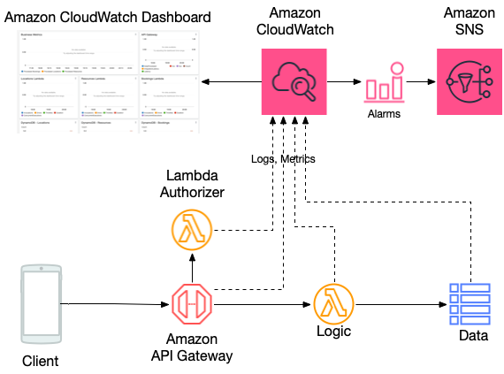
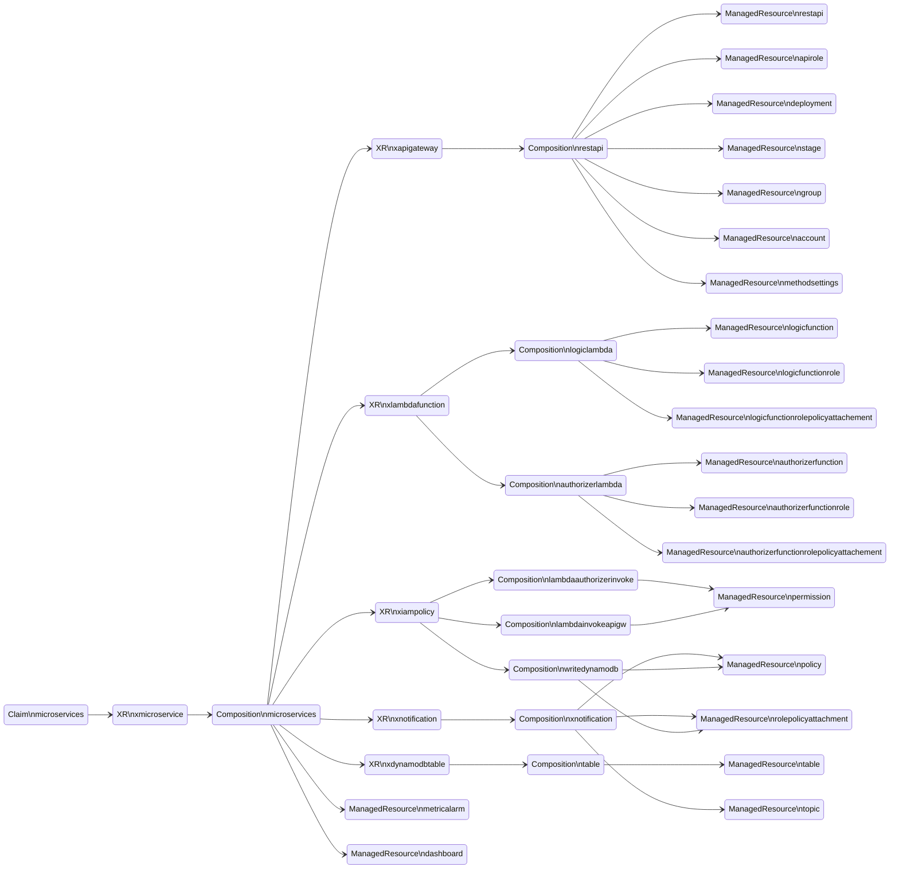

# Example serverless architecture - microservice


This REST API example demonstrates end-to-end implementation of a simple application using a serverless approach, as depicted in the diagram:



Example is (loosely) based on a AWS Serverless Samples repository [serverless-rest-api](https://github.com/aws-samples/serverless-samples/tree/main/serverless-rest-api) project. The services used by this application include Amazon API Gateway, AWS Lambda, and Amazon DynamoDB. Observability implementation is based on AWS CloudWatch Dashboards and MetricAlarms. This example skips CI/CD implementation and unit/integration testing.

## Implementation notes

### API
API uses API Gateway REST API endpoint type with OpenAPI definition that includes proxy resource. All requests are passed to the integration target (AWS Lambda) for routing and interpretation/response generation. API Gateway does not implement any validation, transformation, path based routing, API management functions. You would have to update openAPI in the body property in the composition to implement those features.


API Gateway uses Lambda Authorizer for authentication/authorization. However, sample implementation at `./src/authorizer/lambda_function.py` allows all actions on all resources in the API. Make sure to update authorizer Lambda code according to your authentication/authorization needs. Take a look at Lambda Authorizer code at [serverless-rest-api](https://github.com/aws-samples/serverless-samples/tree/main/serverless-rest-api) for JWT based authorization examples if needed.

### Business logic
Api Gateway passes all the incoming requests to the Lambda function and returns response back to the API client. Sample implementation code is available at `./src/logic/lambda_function.py`. It expects database table name to be specified in the environment variable `TABLE_NAME`. 

For HTTP GET requests to the API `items` resource it runs Amazon DynamoDB `scan` operation and returns all items received as a result. For HTTP GET requests for a particular item (the `items\{id}` resource) it performs `get_item` operation and returns response from the DynamoDB. PUT request to `items` resource takes incoming payload, adds UUID as a hash key value, adds current timestamp, and performs DynamoDB `put_item` operation. It returns payload sent to the Dynamo DB as a response body to the API client.

### Database
Example uses DynamoDB table to store data. Database definition is hardcoded in the composition and includes just a single required `id` field that is used as a hash key. You would need to modify this structure and business logic Lambda code to implement anything more complicated than simple CRUD operations.

# Deployment

## Before you continue
For users new to Crossplane, we recommend first completing Crossplane's official getting started guide: https://docs.crossplane.io/master/getting-started/provider-aws/ in order to grasp the fundamentals of Crossplane. The getting started guide will describe how to authenticate the Crossplane `aws-provider` to an AWS account and create AWS resources from your cluster.

## Pre-requisites:
- [Kubectl](https://kubernetes.io/docs/tasks/tools/)
- [AWS CLI >= v2.0](https://docs.aws.amazon.com/cli/latest/userguide/getting-started-install.html)
- [Terraform >=v1.0.0](https://developer.hashicorp.com/terraform/tutorials/aws-get-started/install-cli)

### Deploy Crossplane
Create an EKS cluster and install Crossplane with [this terraform code](https://github.com/awslabs/crossplane-on-eks/blob/main/bootstrap/terraform/README.md).


### Deploy XRDs and Compositions

Make sure you are in the following directory:
```shell
cd examples/upbound-aws-provider/composite-resources/serverless-examples/microservice/
```

```shell
kubectl apply -k .
```

Verify the XRDs
```shell
kubectl get xrds
```

Expected output
```
NAME                                   ESTABLISHED   OFFERED   AGE
iampolicies.awsblueprints.io        True                    24m
xapigateways.awsblueprints.io       True          True      24m
xdynamodbtables.awsblueprints.io    True          True      24m
xlambdafunctions.awsblueprints.io   True          True      24m
xmicroservices.awsblueprints.io     True          True      24m
xnotifications.awsblueprints.io     True          True      24m
```

Verify the Compositions
```
kubectl get compositions
```
Expected output
```
NAME                                            XR-KIND           XR-APIVERSION               AGE
container.lambda.aws.upbound.awsblueprints.io         XLambdaFunction   awsblueprints.io/v1alpha1   23m
lambda-authorizer-invoke.iampolicy.awsblueprints.io   IAMPolicy         awsblueprints.io/v1alpha1   23m
lambda-invoke-apigw.iampolicy.awsblueprints.io        IAMPolicy         awsblueprints.io/v1alpha1   23m
lambda-invoke.iampolicy.awsblueprints.io              IAMPolicy         awsblueprints.io/v1alpha1   23m
microservices.upbound.awsblueprints.io                XMicroservice     awsblueprints.io/v1alpha1   23m
read-kms.iampolicy.awsblueprints.io                   IAMPolicy         awsblueprints.io/v1alpha1   23m
read-s3.iampolicy.awsblueprints.io                    IAMPolicy         awsblueprints.io/v1alpha1   23m
read-sqs.iampolicy.awsblueprints.io                   IAMPolicy         awsblueprints.io/v1alpha1   23m
rest.apigateway.aws.upbound.awsblueprints.io          XApiGateway       awsblueprints.io/v1alpha1   23m
s3.lambda.aws.upbound.awsblueprints.io                XLambdaFunction   awsblueprints.io/v1alpha1   23m
sns.notification.upbound.awsblueprints.io             XNotification     awsblueprints.io/v1alpha1   23m
table.dynamodb.awsblueprints.io                       XDynamoDBTable    awsblueprints.io/v1alpha1   23m
write-cloudwatch-metrics.iampolicy.awsblueprints.io   IAMPolicy         awsblueprints.io/v1alpha1   23m
write-dynamodb.iampolicy.awsblueprints.io             IAMPolicy         awsblueprints.io/v1alpha1   23m
write-firehose-s3.iampolicy.awsblueprints.io          IAMPolicy         awsblueprints.io/v1alpha1   23m
write-firehose.iampolicy.awsblueprints.io             IAMPolicy         awsblueprints.io/v1alpha1   23m
write-s3.iampolicy.awsblueprints.io                   IAMPolicy         awsblueprints.io/v1alpha1   23m
write-sqs.iampolicy.awsblueprints.io                  IAMPolicy         awsblueprints.io/v1alpha1   23m
```

### Build Lambda function packages

This example uses ZIP packaging of the Lambda functions. 
 - Navigate to `./src/logic/` directory
 - Create ZIP file `microservice-business-logic.zip` with the `lambda_function.py` in it:
```shell
zip microservice-business-logic.zip lambda_function.py
```
 - Navigate to `./src/authorizer/` directory
 - Create ZIP file `microservice-authorizer.zip` with the `lambda_function.py` in it:
```shell
zip microservice-authorizer.zip lambda_function.py
```
 - Create Amazon S3 bucket
 - Upload both ZIP files to the S3 bucket you just created

### Update and apply the claim

Make sure you are in the following directory:
```shell
cd examples/upbound-aws-provider/composite-resources/serverless-examples/microservice/
```

Set the AWS region in the claim with the ones used in the previous step “Build Lambda function packages” where the Lambda ZIP packages were uploaded to S3.
```shell
export AWS_REGION=<replace-with-aws-region> # example `us-east-1`
export S3_BUCKET=<replace-with-s3-bucket-name> # example `my-crossplane-microservice-lambdas`
```

Change the default value for `CLAIM_NAME` with any name you choose.
```shell
export CLAIM_NAME=<replace-with-claim-name> # example `test-rest-api`
```

Run the below command to use the template file `microservice-claim-tmpl.yaml` in the `claim` folder to create the claim file with the variables `CLAIM_NAME`, `S3_BUCKET`, and `AWS_REGION` substituted.
```shell
envsubst < "claim/microservice-claim-tmpl.yaml" > "claim/microservice-claim.yaml"
```

Check that the claim populated with values. Update API name or description values in the claim if desired.
```
cat claim/microservice-claim.yaml
```

Apply the claim
```shell
kubectl apply -f claim/microservice-claim.yaml
```

Validate the claim
```
kubectl get microservices
```

Expected result (it might take sometime before READY=True)
```
NAME                 SYNCED   READY   CONNECTION-SECRET   AGE
test-rest-api        True     True                        1m
```
The claim will create the following resources:



Each XR in the diagram contains the underlying resource refs:
```
kubectl describe xmicroservice | grep "Resource Refs" -A 45
```

Expected output:
```
  Resource Refs:
    API Version:  awsblueprints.io/v1alpha1
    Kind:         XApiGateway
    Name:         test-rest-api-jxwdb-restapi
    API Version:  awsblueprints.io/v1alpha1
    Kind:         XLambdaFunction
    Name:         test-rest-api-jxwdb-logic
    API Version:  awsblueprints.io/v1alpha1
    Kind:         IAMPolicy
    Name:         test-rest-api-jxwdb-logic-invoke
    API Version:  awsblueprints.io/v1alpha1
    Kind:         XDynamoDBTable
    Name:         test-rest-api-jxwdb-data
    API Version:  awsblueprints.io/v1alpha1
    Kind:         IAMPolicy
    Name:         test-rest-api-jxwdb
    API Version:  awsblueprints.io/v1alpha1
    Kind:         XLambdaFunction
    Name:         test-rest-api-jxwdb-authorizer
    API Version:  awsblueprints.io/v1alpha1
    Kind:         IAMPolicy
    Name:         test-rest-api-jxwdb-authorizer-invoke
    API Version:  awsblueprints.io/v1alpha1
    Kind:         XNotification
    Name:         test-rest-api-jxwdb
    API Version:  cloudwatch.aws.upbound.io/v1beta1
    Kind:         MetricAlarm
    Name:         test-rest-api-jxwdb-api-5xx-alarm
    API Version:  cloudwatch.aws.upbound.io/v1beta1
    Kind:         MetricAlarm
    Name:         test-rest-api-jxwdb-database-throttling-alarm
    API Version:  cloudwatch.aws.upbound.io/v1beta1
    Kind:         MetricAlarm
    Name:         test-rest-api-jxwdb-logic-throttling-alarm
    API Version:  cloudwatch.aws.upbound.io/v1beta1
    Kind:         MetricAlarm
    Name:         test-rest-api-jxwdb-logic-error-alarm
    API Version:  cloudwatch.aws.upbound.io/v1beta1
    Kind:         MetricAlarm
    Name:         test-rest-api-jxwdb-authorizer-throttling-alarm
    API Version:  cloudwatch.aws.upbound.io/v1beta1
    Kind:         MetricAlarm
    Name:         test-rest-api-jxwdb-authorizer-error-alarm
    API Version:  cloudwatch.aws.upbound.io/v1beta1
    Kind:         Dashboard
    Name:         test-rest-api-jxwdb-cloudwatch-dashboard
```

### Test

**Testing API endpoint**
 - Get API URL:
   ```shell
   kubectl describe xmicroservice | grep "API Base URL"
   ```
   Create variable with your API base URL:
   ```shell
   export API_BASE_URL=<replace-with-your-API-base-URL> # example `https://abc123456789.execute-api.us-east-1.amazonaws.com/api`
   ```

  - Test endpoint without authorization:
    ```shell
    curl $API_BASE_URL/items
    ```
    Expected output - `{"message":"Unauthorized"}`
 - Test endpoint with authorization:
    ```shell
    curl $API_BASE_URL/items -H "Authorization: Bearer 1234567890"
    ```
    Expected output - `[]`
 - Test endpoint by creating record in the database:
    ```shell
    curl -X PUT $API_BASE_URL/items -H "Authorization: Bearer 1234567890" -d '{"my_data":"Here goes my payload data"}'
    ```
    Expected output - `{"my_data": "Here goes my payload data", "timestamp": "2023-12-21T17:11:51.662839", "id": "087b4aca-a024-11ee-a28c-bbcde0052444"}`
- Get list of items in the database again:
    ```shell
    curl $API_BASE_URL/items -H "Authorization: Bearer 1234567890"
    ```
    Expected output - `[{"my_data": "Here goes my payload data", "id": "087b4aca-a024-11ee-a28c-bbcde0052444", "timestamp": "2023-12-21T17:11:51.662839"}]`
- Note ID of the item and get individual record from the database:
    ```shell
    curl $API_BASE_URL/items/<id of the item> -H "Authorization: Bearer 1234567890"
    ```
    Expected output - `{"my_data": "Here goes my payload data", "id": "087b4aca-a024-11ee-a28c-bbcde0052444", "timestamp": "2023-12-21T17:11:51.662839"}`
- Note ID of the item and delete individual record in the database:
    ```shell
    curl -X DELETE $API_BASE_URL/items/<id of the item> -H "Authorization: Bearer 1234567890"
    ```
    Expected output - `{}`
- Get list of items in the database again and verify that record had been deleted:
    ```shell
    curl $API_BASE_URL/items -H "Authorization: Bearer 1234567890"
    ```
    Expected output - `[]`

**Testing dashboard**
 - Get dashboard URL:
   ```shell
   kubectl describe xmicroservice | grep "Dashboard"
   ```
  - Navigate to the dashboard (you will have to login into the AWS Management Console)

**Testing alerts**

 - Get SNS topic ARN used for notifications:
   ```shell
   kubectl describe xmicroservice | grep "Sns"
   ```
 - Navigate to SNS in the [AWS Management console](https://console.aws.amazon.com/sns/v3/home)
 - Create subscription using ARN from the previous steps, select email as a protocol
 - Simulate failure by setting Lambda reserved concurrency to 0 for business logic or authorizer functions or sending malformed payload to the API endpoint


## Clean Up
Delete the serverless application
```shell
kubectl delete -f claim/microservice-claim.yaml
```

Delete the S3 bucket you've created and the Lambda ZIP packages in it


Delete the XRDs and Compositions
```shell
kubectl delete -k .
```
