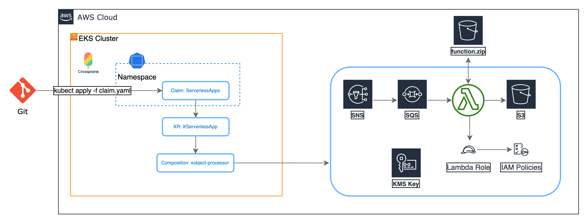

# Example to deploy serverless architecture
This example deploys the architecture depicted on the diagram. First, it applies the Crossplane XRD and Compositions. Then it applies the Claim that creates all the AWS resources, and deploys the code to the Lambda funtion. Last, it send a message to SNS Topic and track it get passed to the SQS Queue, that triggers the Lambda fuction, which posts the results in the S3 bucket.



## Pre-requisites:
 - [Upbound AWS Provider Crossplane Blueprint Examples](../../../README.md)
 - [This serverless appication](../object-processor-app/README.md)

### Deploy XRDs and Compositions

```shell
kubectl apply -k .
```

Verify the XRDs
```shell
kubectl get xrds
```

Expected output
```
NAME                                   ESTABLISHED   OFFERED   AGE
eventsourcemappings.awsblueprints.io   True                    5m
iampolicies.awsblueprints.io           True                    5m
xencryptionkeys.awsblueprints.io       True          True      5m
xfanouts.awsblueprints.io              True          True      5m
xlambdafunctions.awsblueprints.io      True          True      5m
xnotifications.awsblueprints.io        True          True      5m
xobjectstorages.awsblueprints.io       True          True      5m
xqueues.awsblueprints.io               True          True      5m
xserverlessapp.awsblueprints.io        True          True      5m
```

Verify the Compositions
```
kubectl get compositions
```
Expected output
```
NAME                                            AGE
container.lambda.aws.upbound.awsblueprints.io   5m
read-kms.iampolicy.awsblueprints.io             5m
read-s3.iampolicy.awsblueprints.io              5m
read-sqs.iampolicy.awsblueprints.io             5m
s3.lambda.aws.upbound.awsblueprints.io          5m
s3bucket.awsblueprints.io                       5m
sns.notification.upbound.awsblueprints.io       5m
sqs.esm.awsblueprints.io                        5m
sqs.queue.aws.upbound.awsblueprints.io          5m
write-s3.iampolicy.awsblueprints.io             5m
write-sqs.iampolicy.awsblueprints.io            5m
xencryptionkeys-kms.awsblueprints.io            5m
xfanout.awsblueprints.io                        5m
xsnssqslambdas3.awsblueprints.io                5m
xsqslambdas3.awsblueprints.io                   5m
```

#### Update and apply the claim

Replace the bucket name and region in the claim with the ones set in the pre-requizite step [This serverless application](../object-processor-app/README.md) where the `function.zip` file is uploaded.

```shell
export REGION=replace-with-aws-region
export S3_BUCKET=replace-with-unique-s3-bucket
```

Change the default value for `CLAIM_NAME`
```shell
export CLAIM_NAME=test-sns-sqs-lambda-s3
```

Use the template file `sns-sqs-lambda-s3-claim-tmpl.yaml` to create the claim file with the variables `CLAIM_NAME`, `S3_BUCKET`, and `REGION` substituted


```shell
envsubst < "claim/sns-sqs-lambda-s3-claim-tmpl.yaml" > "claim/sns-sqs-lambda-s3-claim.yaml"
```

Apply the claim
```shell
kubectl apply -f claim/sns-sqs-lambda-s3-claim.yaml
```

Validate the claim
```shell
kubectl get serverlessapp
```

Expected result (it might take sometime before READY=True)
```
NAME                     SYNCED   READY   CONNECTION-SECRET   AGE
test-sns-sqs-lambda-s3   True     True                        20m
```

#### Test
Use the following command to get the SNS topic ARN and store it in $SNS_TOPIC_ARN environment variable
```
SNS_TOPIC_ARN=$(aws sns list-topics --region $REGION --output json |jq -r '.Topics | map(select(.TopicArn | contains("function-sns-sqs-test-sns-sqs-lambda-s3"))) | .[0].TopicArn' | tr -d '[:space:]')
```
The command will only store the first topic that contains `function-sns-sqs-test-sns-sqs-lambda-s3` in the name. Validate you have the correct topic:
```shell
echo $SNS_TOPIC_ARN
```

Publish a message to the topic.
```shell
aws sns publish --topic-arn $SNS_TOPIC_ARN --message abc --region $REGION
```

Or push 100 messages to the topic.
```shell
for i in {1..100} ; do aws sns publish --topic-arn $SNS_TOPIC_ARN --message abc --region $REGION ; done
```

Navigate to the AWS console and observe the message getting passed to the SQS, triggering the Lambda, and publishing the result in the S3 bucket.

## Clean Up
Delete the serverless application
```shell
kubectl delete -f claim/sns-sqs-lambda-s3-claim.yaml
```

Delete the bucket
```shell
aws s3 rm s3://${S3_BUCKET}/function.zip
aws s3api delete-bucket --bucket ${S3_BUCKET} # This will fail when the bucket is not empty.
```

Delete the XRDs and Compositions
```shell
kubectl delete -k .
```
