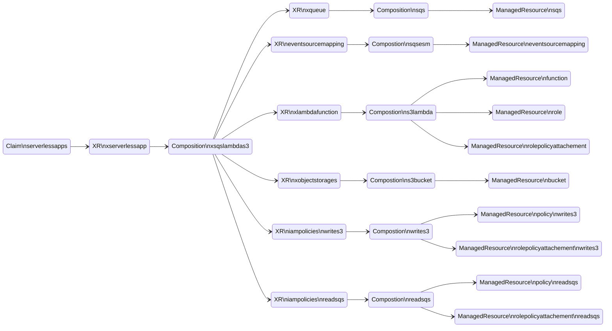

# Example to deploy serverless architecture
This example deploys the architecture depicted on the diagram. First, it applies the Crossplane XRD and Compositions. Then it applies the Claim which creates all the AWS resources, and deploys the code to the Lambda funtion. Last, it send a message to the SQS Queue, that triggers the Lambda fuction, which posts the results in the S3 bucket.


## Pre-requisites:
 - [Upbound AWS Provider Crossplane Blueprint Examples](../../../README.md)
 - [This serverless application](../object-processor-app/README.md)

### Deploy XRDs and Compositions

```shell
kubectl apply -k .
```

Verify the XRDs
```
kubectl get xrds
```
Expected output
```
NAME                                   ESTABLISHED   OFFERED   AGE
eventsourcemappings.awsblueprints.io   True                    5m
iampolicies.awsblueprints.io           True                    5m
xlambdafunctions.awsblueprints.io      True          True      5m
xobjectstorages.awsblueprints.io       True          True      5m
xqueues.awsblueprints.io               True          True      5m
xserverlessapp.awsblueprints.io        True          True      5m
```

Verify the Compositions
```
kubectl get compositions
```
Expected output
```
NAME                                            AGE
read-kms.iampolicy.awsblueprints.io             5m
read-s3.iampolicy.awsblueprints.io              5m
read-sqs.iampolicy.awsblueprints.io             5m
s3.lambda.aws.upbound.awsblueprints.io          5m
s3bucket.awsblueprints.io                       5m
sqs.esm.awsblueprints.io                        5m
sqs.queue.aws.upbound.awsblueprints.io          5m
write-s3.iampolicy.awsblueprints.io             5m
xsnssqslambdas3.awsblueprints.io                5m
xsqslambdas3.awsblueprints.io                   5m
```

#### Update and apply the claim
```
cd claim
```
Replace the bucket name and region in the claim with the ones set in the pre-requizite step [This serverless application](../object-processor-app/README.md) where the `function.zip` file is uploaded.
```
sed -i -e "s/replace-with-unique-s3-bucket/$S3_BUCKET/" sqs-lambda-s3-claim.yaml
sed -i -e "s/replace-with-aws-region/$REGION/" sqs-lambda-s3-claim.yaml
```
Apply the claim
```
kubectl apply -f sqs-lambda-s3-claim.yaml
```
Validate the claim
```
kubectl get serverlessapps
```
Expected result (it might take sometime before READY=True)
```
NAME                 SYNCED   READY   CONNECTION-SECRET   AGE
test-sqs-lambda-s3   True     True                        20m
```
The claim will create the following resources:

Each XR in the diagram contains the underlying resource refs:
```
kubectl describe xserverlessapp | grep "Resource Refs" -A 18
```
Expected output:
```
  Resource Refs:
    API Version:  awsblueprints.io/v1alpha1
    Kind:         XQueue
    Name:         test-sqs-lambda-s3-hc2m5-7qwnb
    API Version:  awsblueprints.io/v1alpha1
    Kind:         EventSourceMapping
    Name:         test-sqs-lambda-s3-hc2m5-9q2kf
    API Version:  awsblueprints.io/v1alpha1
    Kind:         XLambdaFunction
    Name:         test-sqs-lambda-s3-hc2m5-processor
    API Version:  awsblueprints.io/v1alpha1
    Kind:         XObjectStorage
    Name:         test-sqs-lambda-s3-hc2m5-mbqcc
    API Version:  awsblueprints.io/v1alpha1
    Kind:         IAMPolicy
    Name:         test-sqs-lambda-s3-hc2m5-jspzj
    API Version:  awsblueprints.io/v1alpha1
    Kind:         IAMPolicy
    Name:         test-sqs-lambda-s3-hc2m5-2qzfl
```

#### Test
Use the following command to get the SQS URL and store it in $SQS_URL environment variable
```
SQS_URL=$(aws sqs list-queues | jq -r '.QueueUrls|map(select(contains("test-sqs-lambda-s3"))) | .[0]' | tr -d '[:space:]')
```
The command will only store the first url that contains `test-sqs-lambda-s3` in the name. Validate you have the correct url:
```
echo $SQS_URL
```
Send a message to the queue.
```
aws sqs send-message --queue-url $SQS_URL --message-body abc
```
Or send 100 messages to the queue.
```
for i in {1..100}; do aws sqs send-message --queue-url $SQS_URL --message-body abc ; done
```

Navigate to the AWS console and observe the SQS triggering the Lambda, and publishing the result in the S3 bucket.

## Clean Up
Delete the serverless application
```
kubectl delete -f sqs-lambda-s3-claim.yaml
```
Delete the bucket
```
aws s3 rm s3://${S3_BUCKET}/function.zip
aws s3api delete-bucket --bucket ${S3_BUCKET} # This will fail when the bucket is not empty.
```
Delete the XRDs and Compositions
```
cd ..
kubectl delete -k .
```
