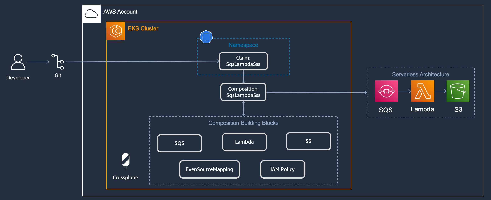
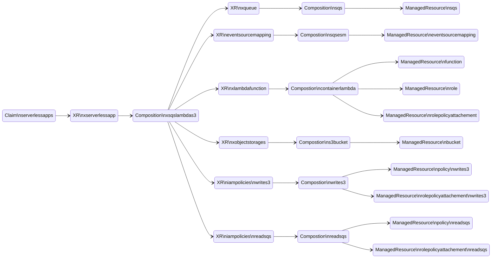

# Example to deploy serverless architecture
This example deploys the architecture depicted on the diagram. First, it applies the Crossplane Composite Resource Definitions (XRDs) and Compositions. Then it applies the Claim which creates all the AWS resources, and deploys the code to the Lambda function. Last, it sends a message to the SQS Queue, that triggers the Lambda function, which posts the results in the S3 bucket.


## Before you continue
For users new to Crossplane, we recommend first completing Crossplane's official getting started guide: https://docs.crossplane.io/master/getting-started/provider-aws/ in order to grasp the fundamentals of Crossplane. The getting started guide will describe how to authenticate the Crossplane `aws-provider` to an AWS account and create AWS resources from your cluster.

## Pre-requisites:
- [Kubectl](https://kubernetes.io/docs/tasks/tools/)
- [AWS CLI >= v2.0](https://docs.aws.amazon.com/cli/latest/userguide/getting-started-install.html)
- [Terraform >=v1.0.0](https://developer.hashicorp.com/terraform/tutorials/aws-get-started/install-cli)

### Deploy Crossplane
Create an EKS cluster and install Crossplane with [this terraform code](https://github.com/awslabs/crossplane-on-eks/blob/main/bootstrap/terraform/README.md).

### Build and deploy a docker image
As described in [Option 1: Container of this Go application](https://github.com/awslabs/crossplane-on-eks/blob/main/examples/upbound-aws-provider/composite-resources/serverless-examples/object-processor-app/README.md#option-1-container), build the Docker image with a sample app, create an ECR repo, and upload the image to it. The container image contains the source code for the Lambda function.

### Deploy XRDs and Compositions
Navigate to the following directory:
```shell
cd examples/upbound-aws-provider/composite-resources/serverless-examples/sqs-lambda-s3/
```

and run the command below
```shell
kubectl apply -k .
```

Verify the XRDs
```shell
kubectl get xrds
```

Expected output
```
NAME                                   ESTABLISHED   OFFERED   AGE
eventsourcemappings.awsblueprints.io   True                    5m
iampolicies.awsblueprints.io           True                    5m
xlambdafunctions.awsblueprints.io      True          True      5m
xobjectstorages.awsblueprints.io       True          True      5m
xqueues.awsblueprints.io               True          True      5m
xserverlessapp.awsblueprints.io        True          True      5m
```

Verify the Compositions
```shell
kubectl get compositions
```

Expected output. Note: the output might contain more compositions but these are the ones uses by the claim in the next step
```
NAME                                                  XR-KIND              XR-APIVERSION               AGE
container.lambda.aws.upbound.awsblueprints.io         XLambdaFunction      awsblueprints.io/v1alpha1   5m
read-s3.iampolicy.awsblueprints.io                    IAMPolicy            awsblueprints.io/v1alpha1   5m
read-sqs.iampolicy.awsblueprints.io                   IAMPolicy            awsblueprints.io/v1alpha1   5m
s3bucket.awsblueprints.io                             XObjectStorage       awsblueprints.io/v1alpha1   5m
sqs.esm.awsblueprints.io                              EventSourceMapping   awsblueprints.io/v1alpha1   5m
sqs.queue.aws.upbound.awsblueprints.io                XQueue               awsblueprints.io/v1alpha1   5m
write-s3.iampolicy.awsblueprints.io                   IAMPolicy            awsblueprints.io/v1alpha1   5m
xsqslambdas3.awsblueprints.io                         XServerlessApp       awsblueprints.io/v1alpha1   5m
```

### Update and apply the claim

Make sure you are in the following directory:
```shell
cd examples/upbound-aws-provider/composite-resources/serverless-examples/sqs-lambda-s3/
```

Set the image name and AWS region in the claim with the ones set in the previous step “Build and deploy a docker image” where the docker image is uploaded to ECR.
```shell
export AWS_REGION=<replace-with-aws-region> # example `us-east-1`
export IMAGE_NAME=<replace-with-image-name> # example `lambda-test`
```

Change the default value for `CLAIM_NAME` with any name you choose.
```shell
export CLAIM_NAME=<replace-with-claim-name> # example `test-sqs-lambda-s3`
```

Run the below command to use the template file `sqs-lambda-s3-claim-tmpl.yaml` in the `claim` folder to create the claim file with the variables `CLAIM_NAME`, `IMAGE_NAME`, and `AWS_REGION` substituted.
```shell
envsubst < "claim/sqs-lambda-s3-claim-tmpl.yaml" > "claim/sqs-lambda-s3-claim.yaml"
```

Check that the claim populated with values
```
cat claim/sqs-lambda-s3-claim.yaml
```

Apply the claim
```shell
kubectl apply -f claim/sqs-lambda-s3-claim.yaml
```

Validate the claim
```
kubectl get serverlessapps
```

Expected result (it might take sometime before READY=True)
```
NAME                 SYNCED   READY   CONNECTION-SECRET   AGE
test-sqs-lambda-s3   True     True                        20m
```

The claim will create the following resources:

Each XR in the diagram contains the underlying resource refs:
```
kubectl describe xserverlessapp | grep "Resource Refs" -A 18
```
Expected output:
```
  Resource Refs:
    API Version:  awsblueprints.io/v1alpha1
    Kind:         XQueue
    Name:         test-sqs-lambda-s3-hc2m5-7qwnb
    API Version:  awsblueprints.io/v1alpha1
    Kind:         EventSourceMapping
    Name:         test-sqs-lambda-s3-hc2m5-9q2kf
    API Version:  awsblueprints.io/v1alpha1
    Kind:         XLambdaFunction
    Name:         test-sqs-lambda-s3-hc2m5-processor
    API Version:  awsblueprints.io/v1alpha1
    Kind:         XObjectStorage
    Name:         test-sqs-lambda-s3-hc2m5-mbqcc
    API Version:  awsblueprints.io/v1alpha1
    Kind:         IAMPolicy
    Name:         test-sqs-lambda-s3-hc2m5-jspzj
    API Version:  awsblueprints.io/v1alpha1
    Kind:         IAMPolicy
    Name:         test-sqs-lambda-s3-hc2m5-2qzfl
```

### Test
Use the following command to get the SQS URL and store it in $SQS_URL environment variable
```shell
SQS_URL=$(aws sqs list-queues --output json | jq -r '.QueueUrls|map(select(contains("test-sqs-lambda-s3"))) | .[0]' | tr -d '[:space:]')
```

The command will only store the first url that contains `test-sqs-lambda-s3` in the name. Validate you have the correct url:
```shell
echo $SQS_URL
```

Send a message to the queue.
```shell
aws sqs send-message --queue-url $SQS_URL --message-body abc
```

Or send 100 messages to the queue.
```shell
for i in {1..100}; do aws sqs send-message --queue-url $SQS_URL --message-body abc ; done
```

Navigate to the AWS console and observe the SQS triggering the Lambda, and publishing the result in the S3 bucket.

## Clean Up
Delete the serverless application
```shell
kubectl delete -f claim/sqs-lambda-s3-claim.yaml
```

Delete the repository
```shell
aws ecr delete-repository $IMAGE_NAME
```

Delete the XRDs and Compositions
```shell
kubectl delete -k .
```
